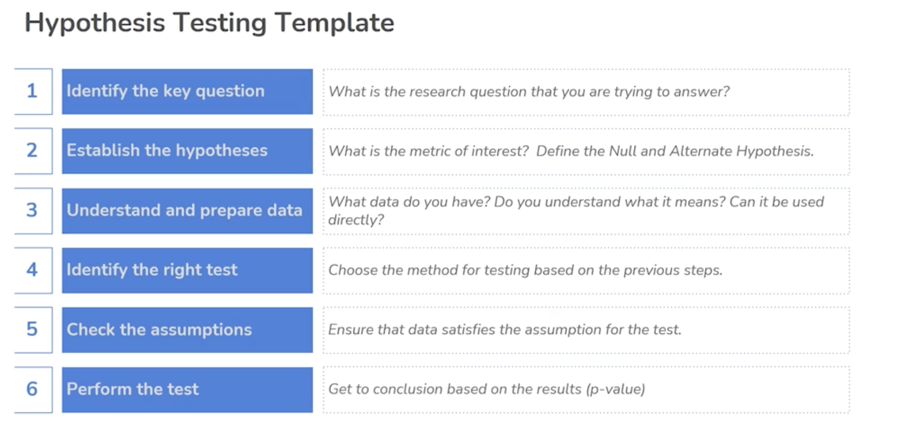
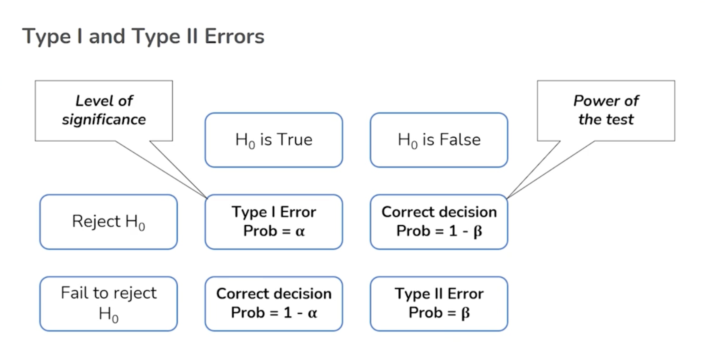
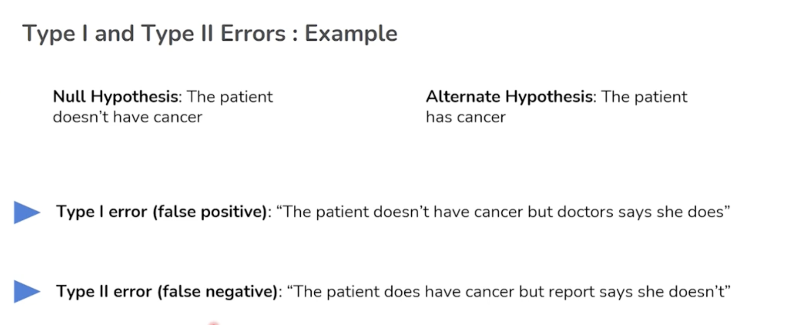
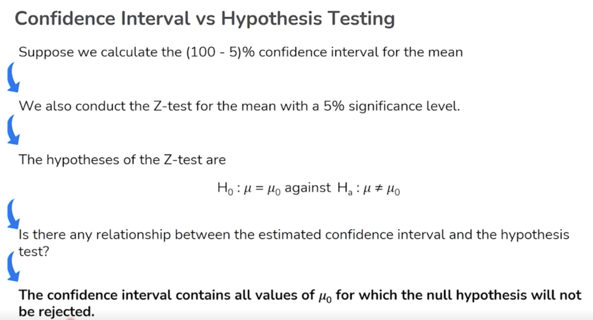
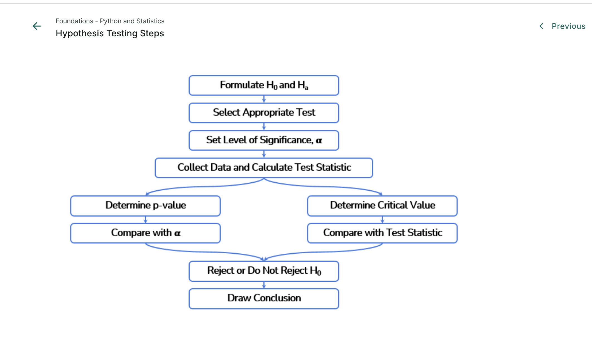

> 

# 📊 Hypothesis Testing - Summary Guide

> This Markdown document is designed for MkDocs Material theme. It includes detailed summaries, embedded images, Colab links, CSV datasets, and use case examples based on the screenshots provided for the Hypothesis Testing lesson.

---

## 📌 Quick Navigation

- [1. Introduction to Hypothesis Testing](#1-introduction-to-hypothesis-testing)
- [2. Hypothesis Testing Template](#2-hypothesis-testing-template)
- [3. Type I and Type II Errors](#3-type-i-and-type-ii-errors)
- [4. Confidence Interval vs Hypothesis Testing](#4-confidence-interval-vs-hypothesis-testing)
- [5. Hypothesis Testing Workflow](#5-hypothesis-testing-workflow)
- [6. CSV Dataset and Python Code](#6-csv-dataset-and-python-code)
- [7. References & Further Reading](#7-references--further-reading)

---

## 1. Introduction to Hypothesis Testing

Hypothesis testing is a statistical inference process to decide whether a hypothesis about a population parameter should be accepted or rejected, based on sample data.

- Null Hypothesis (H₀): Assumes no effect or no difference.
- Alternative Hypothesis (H₁): Assumes a significant effect or difference exists.

It is a core part of inferential statistics used in quality control, A/B testing, drug trials, and more.

### Use Case Example

- **Healthcare**: Testing whether a new treatment has a statistically significant impact on blood pressure.
- **Business**: A/B testing two versions of a web page to see which has higher conversion.

[Back to Top](#-quick-navigation)

---

## 2. Hypothesis Testing Template

> 

### Steps:
1. Identify the key question (e.g., "Does this training program improve employee productivity?")
2. Define null and alternative hypotheses.
3. Understand and prepare data.
4. Identify the correct statistical test.
5. Check assumptions.
6. Run the test and interpret the results.

[Back to Top](#-quick-navigation)

---

## 3. Type I and Type II Errors

> 

> 

### Example Scenario:
- **Null Hypothesis**: The patient does not have cancer
- **Alternative Hypothesis**: The patient has cancer

### Errors:
- **Type I Error (False Positive)**: Concluding the patient has cancer when they don’t.
- **Type II Error (False Negative)**: Concluding the patient doesn't have cancer when they do.

### Table Summary:

| Decision | H₀ is True | H₀ is False |
|----------|------------|-------------|
| Reject H₀ | Type I Error (α) | Correct Decision (1 - β) |
| Fail to Reject H₀ | Correct Decision (1 - α) | Type II Error (β) |

- **Power of the test** = 1 - β

[Back to Top](#-quick-navigation)

---

## 4. Confidence Interval vs Hypothesis Testing

- A 95% confidence interval provides a range of plausible values for the population mean.
- A Z-test at 5% significance level is used to test whether the observed sample mean differs from a hypothesized population mean.

If the null hypothesis value μ₀ is within the 95% confidence interval, we **fail to reject** the null.

### Relationship:
- Confidence interval contains all values of μ₀ for which H₀ is **not** rejected.

[Back to Top](#-quick-navigation)

---

## 5. Hypothesis Testing Workflow

> 

### Step-by-Step Flow:
1. Formulate H₀ and H₁
2. Select the appropriate test (Z-test, t-test, etc.)
3. Set significance level α
4. Collect data & compute test statistic
5. Determine p-value or critical value
6. Compare and make decision
7. Draw conclusion

[Back to Top](#-quick-navigation)

---

## 6. CSV Dataset and Python Code

### 🧪 Open in Colab:
👉 [Notebook_Hypothesis_Testing.ipynb](https://drive.google.com/file/d/1Wigcmj9mSDAsOCofSnT13A-0kgOFQNc3/view?usp=sharing)  

### 📂 CSV Download

- 👉 [Download debugging.csv](https://drive.google.com/uc?export=download&id=1H-1dVA9o-TLk0IdArDad3V2W7BnZPG22)
- 📎 [View CSV in Drive](https://drive.google.com/file/d/1H-1dVA9o-TLk0IdArDad3V2W7BnZPG22/view)

[Back to Top](#-quick-navigation)

---

## 7. References & Further Reading

- [NumPy Docs](https://numpy.org/doc/)
- [Pandas Docs](https://pandas.pydata.org/docs/)
- [Seaborn Docs](https://seaborn.pydata.org/)
- [Plotly Python Docs](https://plotly.com/python/)
- [Khan Academy - Stats](https://www.khanacademy.org/math/statistics-probability)
- [MIT OpenCourseWare](https://ocw.mit.edu/)
- [StatQuest - Josh Starmer](https://www.youtube.com/user/joshstarmer)
- [Scikit-learn User Guide](https://scikit-learn.org/stable/user_guide.html)

[Back to Top](#-quick-navigation)
---

**← Previous:** [Distributions](03-distributions.md)  
**→ Next:** [Hypothesis Testing - Part 2](05-hypothesis-testing-part2.md)