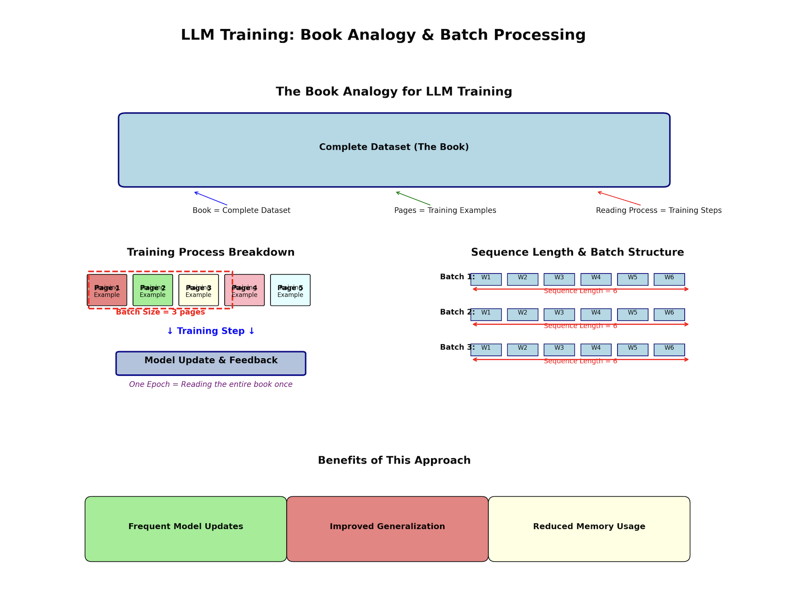
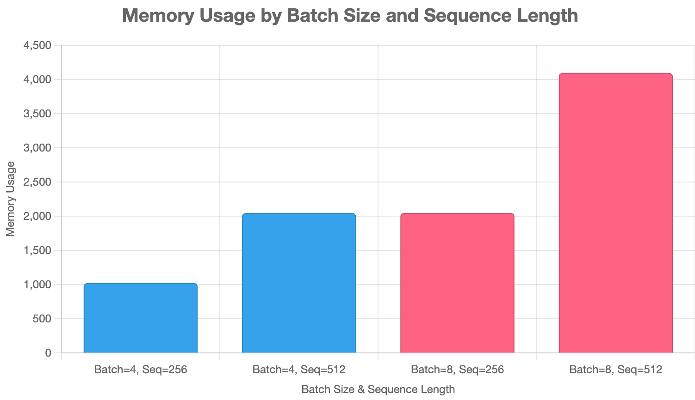
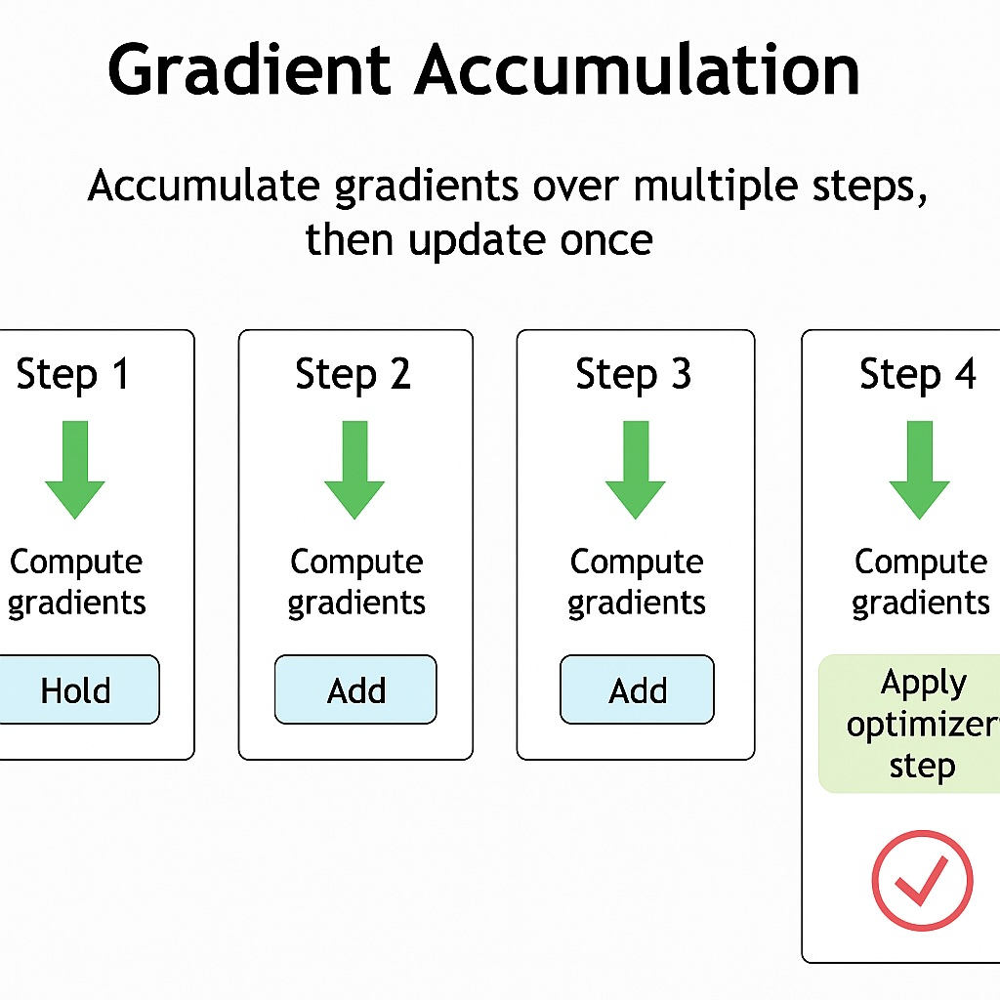

## 📌 Quick Navigation

- [Understanding Practical Limitations](#understanding-practical-limitations)
- [Boosting Efficiency: PeFT and LoRA in Depth](#boosting-efficiency-peft-and-lora-in-depth)
- [Managing Data Memory: Batch Size & Sequence Length](#managing-data-memory-batch-size-sequence-length)
- [Advanced Solutions: Gradient Accumulation & Checkpointing](#advanced-solutions-gradient-accumulation-checkpointing)
- [Fitting Giants: Practical Introduction to LoRA for Large Models](#fitting-giants-practical-introduction-to-lora-for-large-models)
- [Expanding LoRA: Adapter Merging and Effective Evaluations](#expanding-lora-adapter-merging-and-effective-evaluations)


## Understanding Practical Limitations
- [Overview](#overview)
- [Training Challenges with Large Models](#training-challenges-with-large-models)
- [Memory Constraints & Optimization](#memory-constraints--optimization)
- [Advanced Configuration Example](#advanced-configuration-example)
- [Smarter Training with LoRA](#smarter-training-with-lora)
- [References & Further Reading](#references--further-reading)

---

## Overview

This section builds upon the previous lessons by transitioning from small-scale LLMs to working with **larger models** like Meta’s *LLaMA 3.1 8B*. The focus is on highlighting **practical limitations** and **advanced optimization techniques** to train large models with **limited hardware resources**.

👉 This tutorial used the `unsloth/Meta-Llama-3.1-8B-Instruct` base model and a custom storytelling dataset.

[Back to Top](#quick-navigation)

---

## Training Challenges with Large Models

### Goals:
- Scale from small to 8B+ parameter models
- Use real-world model: `LLaMA 3.1 - Sloth Variant`

### Observations:
- Running on consumer-grade GPU (e.g., 24GB) fails due to:
  - Tokenizer misconfiguration
  - Out-of-memory errors even at minimal batch sizes

- Reducing batch size & sequence length:
  - ✅ Enables training
  - ❌ Hurts final performance

[Back to Top](#quick-navigation)

---

## Memory Constraints & Optimization

### Issues:
- Model weights, optimizer, and dataset compete for memory
- Even smallest 8B variant cannot fit fully

### Solutions Explored:
- Minimal batch size = 1
- Sequence length halved
- Still fails on common GPUs

### Suggested Direction:
- Use smarter techniques:
  - 🟢 LoRA (Low-Rank Adaptation)
  - 🟢 Gradient Checkpointing
  - 🟢 Mixed Precision (bf16/8bit)

[Back to Top](#quick-navigation)

---

## Advanced Configuration Example

```yaml
# Source: advanced_train.yml
base_model: unsloth/Meta-Llama-3.1-8B-Instruct
datasets:
  - path: jaydenccc/AI_Storyteller_Dataset
    type:
      system_prompt: "You are an amazing storyteller. From the following synopsis, create an engaging story."
      field_instruction: synopsis
      field_output: short_story
output_dir: ./models/Llama3_Storyteller2
sequence_length: 1024
micro_batch_size: 4
optimizer: adamw_bnb_8bit
learning_rate: 0.0002
adapter: lora
lora_r: 32
lora_alpha: 16
lora_dropout: 0.05
gradient_checkpointing: true
```

👉 [Open in Colab](https://colab.research.google.com/drive/1ntPiYbPZ8VomtKuIpEKUEKqdvJiSR3bH?usp=sharing)  
[](https://colab.research.google.com/drive/1ntPiYbPZ8VomtKuIpEKUEKqdvJiSR3bH?usp=sharing)

[Back to Top](#quick-navigation)

---

## Smarter Training with LoRA

LoRA is introduced as a **lightweight fine-tuning** mechanism.

### Benefits:
- Reduces GPU memory footprint
- Only updates a few trainable parameters
- Compatible with large models like LLaMA

### Combined With:
- bf16 or tf32 mixed precision
- Gradient Checkpointing
- 8bit optimizer (bnb)

[Back to Top](#quick-navigation)

---

## References & Further Reading

- [Meta LLaMA 3.1 on Hugging Face](https://huggingface.co/meta-llama)
- [LoRA: Low-Rank Adaptation of Large Language Models (ArXiv)](https://arxiv.org/abs/2106.09685)
- [Hugging Face Transformers Docs](https://huggingface.co/docs/transformers/index)
- [Jay Alammar's Blog: The Illustrated Transformer](https://jalammar.github.io/illustrated-transformer/)
- [Google Colab Guide](https://colab.research.google.com/)
- [OpenAI Cookbook](https://github.com/openai/openai-cookbook)
- [NVIDIA: Memory-Efficient Training](https://developer.nvidia.com/blog)

[Back to Top](#quick-navigation)


## Boosting Efficiency: PeFT and LoRA in Depth

## 📌 Quick Navigation

- [Overview: The Problem with Full Fine-Tuning](#overview-the-problem-with-full-fine-tuning)
- [Memory Usage Breakdown](#memory-usage-breakdown)
- [Introduction to Parameter-Efficient Fine-Tuning](#introduction-to-parameter-efficient-fine-tuning)
- [LoRA: Low-Rank Adaptation Explained](#lora-low-rank-adaptation-explained)
- [Hyperparameters in LoRA](#hyperparameters-in-lora)
- [Benefits and Applications](#benefits-and-applications)
- [References & Further Reading](#references--further-reading)

---

## Overview: The Problem with Full Fine-Tuning

Fine-tuning large language models (LLMs) often exceeds hardware capabilities due to massive memory demands. The key goals of improving training efficiency are:

- 🟢 Lower memory requirements.
- 🟢 Maintain model performance and accuracy.
- 🟢 Democratize access to LLM customization on limited hardware.

Full fine-tuning is resource-intensive due to the need to update all model parameters, gradients, and optimizer states for every step.

[Back to Top](#quick-navigation)

---

## Memory Usage Breakdown

Training large models consumes memory across four key areas:

| Component         | Description                                            | Memory Usage                        |
|------------------|--------------------------------------------------------|-------------------------------------|
| Model Parameters | Learned weights of the model                           | 2 × N GB (for N billion params @ FP16) |
| Gradients        | Gradients for backpropagation                          | 2 × N GB                             |
| Optimizer States | Additional states like moment estimates in Adam        | ~4–8 × N GB                          |
| Training Data    | Input sequences + embeddings per batch                 | Variable (based on batch/seq length) |

➡️ Total: **8–12×** the model parameter memory.

[Back to Top](#quick-navigation)

---

## Introduction to Parameter-Efficient Fine-Tuning

Rather than updating all parameters, **Parameter-Efficient Fine-Tuning (PEFT)** updates only a targeted subset of the model. This reduces resource requirements while maintaining task-specific performance.

One of the most prominent PEFT techniques is:

- 🔵 **LoRA (Low-Rank Adaptation)** — inserts trainable, low-rank matrices into layers of a frozen pre-trained model.

[Back to Top](#quick-navigation)

---

## LoRA: Low-Rank Adaptation Explained

LoRA modifies only a small number of parameters by introducing additional matrices into each layer of the frozen model.

### 🎯 Key Concepts

- Fine-tunes LLMs by updating low-rank matrices (`A` and `B`) instead of full weight matrices `W`.
- Adds `ΔW = A × B` to `W` during forward pass.
- Enables efficient updates and reduces memory overhead.

### 🧠 LoRA - Parameter and its usage 
| Parameter      | Description                                                                             | Influence on Memory                                                | Influence on Runtime                            |
|:---------------|:----------------------------------------------------------------------------------------|:-------------------------------------------------------------------|:------------------------------------------------|
| r (rank)       | The rank of the LoRA matrices. Lower values reduce memory and computation cost.         | ✅ Lower rank = less memory usage                                  | ✅ Lower rank = faster computation              |
| alpha          | Scaling factor applied to the LoRA output. Usually alpha / r is the effective scale.    | 🔁 No direct memory impact, but may influence scale of activations | ➖ May affect gradient scale, but not runtime   |
| dropout        | Dropout probability applied to the LoRA layers to regularize during training.           | ➖ Slight additional memory usage due to dropout mask              | ➖ Slight slowdown during training              |
| bias           | Whether to include bias terms. Can be 'none', 'all', or 'lora_only'.                    | ➖ Adds small amount of memory if bias is included                 | ➖ Minor impact if biases are added             |
| target_modules | List of module names where LoRA adapters should be inserted (e.g., 'q_proj', 'v_proj'). | ✅ Selective targeting reduces memory footprint                    | ✅ Reduces compute by targeting specific layers |
| merge_weights  | If True, merges LoRA weights with the original model weights during inference.          | ✅ Merging removes need for separate LoRA weights at inference     | ✅ Faster inference by removing adapter layers  |

 

### 🔗 Hugging Face + ArXiv

- [LoRA Model on Hugging Face](https://huggingface.co/docs/peft/index)
- [Original Paper - LoRA: Low-Rank Adaptation](https://arxiv.org/abs/2106.09685)

 

[Back to Top](#quick-navigation)

---

## Hyperparameters in LoRA

| Hyperparameter     | Role                                                             | Typical Value(s) |
|--------------------|------------------------------------------------------------------|------------------|
| `rank` (r)         | Size of the low-rank matrices                                    | 8, 16, 32        |
| `alpha`            | Scaling factor for ΔW = α × A × B                                | 16 (default)     |
| `dropout`          | Regularization to prevent overfitting                            | 0.0 – 0.1        |
| `target_modules`   | Model layers to apply LoRA (e.g., `query`, `value`, etc.)        | Varies           |

> 📌 Higher `rank` means better task adaptation, but at a cost to memory savings.
> 📌 Lower `rank` helps prevent **catastrophic forgetting** during fine-tuning.

[Back to Top](#quick-navigation)

---

## Benefits and Applications

### 🟢 Advantages of LoRA

- Reduces GPU memory footprint by >80%
- Avoids catastrophic forgetting
- Accelerates training time
- Easily pluggable into existing transformer architectures
- Works well on small datasets

### 🛠️ Example Use Cases

- Personalizing a chatbot without retraining a full LLM
- Domain-specific adaptation (e.g., legal, healthcare)
- Multilingual extensions using LoRA adapters per language

[Back to Top](#quick-navigation)

---

## References & Further Reading

- [LoRA: Low-Rank Adaptation of Large Language Models (ArXiv)](https://arxiv.org/abs/2106.09685)
- [Hugging Face PEFT Documentation](https://huggingface.co/docs/peft/index)
- [Jay Alammar – LoRA Illustrated](https://jalammar.github.io)
- [NVIDIA – Efficient Fine-Tuning Techniques](https://developer.nvidia.com/blog)
- [Google – Parameter-Efficient Transfer Learning](https://ai.googleblog.com/)
- [Meta AI Research – PEFT Methods](https://ai.facebook.com/research/)
- [OpenAI – Scaling Laws and Efficient Training](https://openai.com/research)
- [Microsoft – LoRA Integration in DeepSpeed](https://www.microsoft.com/en-us/research/project/deepspeed/)

[Back to Top](#quick-navigation)


---

## Managing Data Memory: Batch Size & Sequence Length

## 📌 Quick Navigation

- [Introduction to Memory Efficiency](#introduction-to-memory-efficiency)
- [Training Analogy: Book, Pages, and Feedback](#training-analogy-book-pages-and-feedback)
- [Core Training Parameters](#core-training-parameters)
  - [Batch Size](#batch-size)
  - [Sequence Length](#sequence-length)
- [Trade-offs in Training Efficiency](#trade-offs-in-training-efficiency)
- [References & Further Reading](#references--further-reading)

---

## Introduction to Memory Efficiency

In the previous lesson, we explored **LoRA (Low-Rank Adaptation)** as a method to reduce memory usage during fine-tuning of Large Language Models (LLMs) by modifying only a subset of model parameters.

In this session, we shift our focus to the **memory consumption from data**—specifically, how the structure of the input data (e.g., batch size and sequence length) affects training efficiency, cost, and feasibility.

[Back to Top](#quick-navigation)

---

## Training Analogy: Book, Pages, and Feedback

To illustrate how models learn from data, the lesson uses an analogy:

- **Book** → The complete dataset
- **Page** → A single training example
- **Reading a few pages then testing** → A **training step**
- **Reading the full book once** → One **epoch**
- **Number of pages per step** → **Batch size**
- **Words per page** → **Sequence length**





This incremental reading process enables:
- Frequent model updates
- Improved generalization
- Reduced memory usage per training step

[Back to Top](#quick-navigation)

---

## Core Training Parameters

### Batch Size

- Determines how many training examples are processed before a model update.
- Larger batches:
  - Require more memory
  - Yield more accurate gradients (faster convergence)
  - Are often limited by GPU/TPU capacity
- Smaller batches:
  - Reduce memory consumption
  - Introduce noisier gradients, which may help generalization

### Sequence Length

- Number of tokens per training example.
- Longer sequences:
  - Require more memory and compute
  - Contain richer contextual information
- Shorter sequences:
  - Allow for bigger batch sizes
  - Reduce computation time
  - May lack enough context for learning

📉 **Trade-off**: You often reduce batch size to accommodate longer sequences within memory limits.

[Back to Top](#quick-navigation)

---

## Trade-offs in Training Efficiency

When training LLMs, we often **cannot afford large batch sizes** due to memory limits.

- Rarely does batch size get “too large”
- Commonly, batch size becomes “too small” due to memory constraints
- The key challenge:
  > _How to gain the benefits of large batch training without overwhelming memory resources?_

Solutions to these constraints will be covered in the next lesson.

[Back to Top](#quick-navigation)

---

## References & Further Reading

- [LoRA: Low-Rank Adaptation of Large Language Models (arXiv)](https://arxiv.org/abs/2106.09685)
- [Jay Alammar – Illustrated Transformer](https://jalammar.github.io/illustrated-transformer/)
- [Hugging Face – Transformers Documentation](https://huggingface.co/docs/transformers/index)
- [OpenAI Blog](https://openai.com/blog/)
- [Google Research](https://research.google/)
- [Microsoft Research – DeepSpeed](https://www.microsoft.com/en-us/research/project/deepspeed/)
- [NVIDIA Developer Blog](https://developer.nvidia.com/blog/)
- [Facebook AI Research (FAIR)](https://ai.facebook.com/)

---

 

➡️ [Back to Top](#quick-navigation)

---

## Advanced Solutions: Gradient Accumulation & Checkpointing

## 📌 Quick Navigation

- [Micro-Batching and Gradient Accumulation](#micro-batching-and-gradient-accumulation)
- [Gradient Checkpointing](#gradient-checkpointing)
- [Efficiency Method Comparison Table](#efficiency-method-comparison-table)
- [References & Further Reading](#references--further-reading)

---

## Micro-Batching and Gradient Accumulation

Training large language models (LLMs) often requires careful memory management. Two primary techniques help in this regard: **Micro-batching** and **Gradient Accumulation**.

### Micro-Batching

- A large batch is split into **micro-batches** to fit in limited memory.
- Each micro-batch is processed sequentially.
- Gradients are accumulated to simulate a larger batch.
- Enables efficient training on hardware with limited GPU memory.

**Effective Batch Size Formula**:
```
Effective Batch Size = Micro Batch Size × Gradient Accumulation Steps × Number of GPUs
```

🖼️ 

> _Alt text_: Diagram showing micro-batch pages filling a book one by one, representing how gradient accumulation simulates a large batch.

---

### Gradient Accumulation

- Performs multiple forward/backward passes per optimization step.
- Gradients are aggregated before updating the model.
- Reduces memory usage but increases training time.

🔧 **Tip**: Choose the largest micro-batch size that fits your GPU and increase accumulation steps only when necessary.

📉 **Example**:

| Micro Batch Size | Accumulation Steps | GPUs | Effective Batch Size |
|------------------|--------------------|------|-----------------------|
| 4                | 2                  | 1    | 8                     |
| 1                | 16                 | 4    | 64                    |

 

[Back to Top](#quick-navigation)

---

## Gradient Checkpointing

### The Problem

- Training LLMs requires storing many **activations** during the forward pass.
- These activations are needed for computing gradients in the backward pass.
- Storing all of them consumes significant GPU memory.

### The Solution: Checkpointing

- **Gradient Checkpointing** stores only selected activations during forward pass.
- During backward pass, missing activations are recomputed.
- Balances memory savings with added computation.

🖼️ 

> _Alt text_: Diagram showing checkpoint blocks within the model to reduce activation memory.

📊 **Benefits**:
- Substantial memory savings
- Trade-off: Slight increase in training time
 
[Back to Top](#quick-navigation)

---

## Efficiency Method Comparison Table

| Method                  | Memory Usage | Training Speed | Accuracy Impact | Notes |
|-------------------------|--------------|----------------|------------------|-------|
| 🟢 **LoRA**             | High savings | Moderate       | Neutral to Slight loss | Trains subset of weights |
| 🔵 **Small Batch Size** | Medium       | Faster (large batch) | Neutral     | Limited if model needs larger batches |
| 🔵 **Gradient Accumulation** | High savings | Slower        | Slightly Better | Allows larger effective batch |
| 🟢 **Gradient Checkpointing** | High savings | Slower        | Neutral        | Strategic activation savings |
| 🔴 **Mixed Precision**  | Very High    | Faster (with FP16) | Slight loss   | Risk of instability at low precision |

[Back to Top](#quick-navigation)

---

## References & Further Reading

- [Attention is All You Need – Vaswani et al. (ArXiv)](https://arxiv.org/abs/1706.03762)
- [Hugging Face Transformers Documentation](https://huggingface.co/docs/transformers/index)
- [Jay Alammar’s Illustrated Transformer](https://jalammar.github.io/illustrated-transformer/)
- [NVIDIA – Gradient Accumulation & Mixed Precision](https://developer.nvidia.com/blog/)
- [OpenAI Research Papers](https://openai.com/research)
- [Microsoft DeepSpeed Memory Optimization](https://www.microsoft.com/en-us/research/project/deepspeed/)
- [Google AI Blog: Efficient Training Techniques](https://ai.googleblog.com/)
- [Facebook AI Gradient Checkpointing](https://ai.facebook.com/)

[Back to Top](#quick-navigation)


➡️ [Back to Top](#quick-navigation)

---

## Fitting Giants: Practical Introduction to LoRA for Large Models

## 📌 Quick Navigation

- [Micro-Batching & Gradient Accumulation](#micro-batching--gradient-accumulation)
- [Gradient Checkpointing](#gradient-checkpointing)
- [LoRA (Low-Rank Adaptation)](#lora-low-rank-adaptation)
- [Batch Size Trade-offs](#batch-size-trade-offs)
- [Mixed Precision Training](#mixed-precision-training)
- [Technique Comparison Summary](#technique-comparison-summary)
- [References & Further Reading](#references--further-reading)

---

## Micro-Batching & Gradient Accumulation

Micro-batching enables large batch benefits on memory-constrained hardware. By splitting a large batch into smaller "micro-batches", the system accumulates gradients across them before a single optimizer update.

### 🔁 Gradient Accumulation

- Forward and backward passes are done over smaller micro-batches.
- Gradients are accumulated in memory across steps.
- A single optimizer update is performed after N steps.

#### Formula for Effective Batch Size

\[
\text{Effective Batch Size} = \text{Micro Batch Size} \times \text{Accumulation Steps} \times \text{# of GPUs}
\]

- **Example 1**: Micro batch = 4, steps = 2, 1 GPU → Effective Batch Size = 8
- **Example 2**: Micro batch = 1, steps = 16, 4 GPUs → Effective Batch Size = 64

🟢 Pros:
- Enables large effective batch sizes on small GPUs
- Good generalization performance

🔴 Cons:
- Slower training due to repeated forward/backward passes

👉 [Open in Colab](https://colab.research.google.com/)  
[](https://colab.research.google.com/)

[Back to Top](#quick-navigation)

---

## Gradient Checkpointing

Gradient checkpointing saves memory by selectively storing activations during the forward pass.

### ⛓️ Concept

- Store only key activations ("checkpoints") during the forward pass
- During backpropagation, re-compute non-stored activations as needed

🟢 Pros:
- Significant memory savings
- Feasible for training large models on limited hardware

🔴 Cons:
- Slower training due to partial recomputation

📘 [Hugging Face Docs](https://huggingface.co/docs/transformers/perf_train_gpu_one#gradient-checkpointing)  
📄 [Gradient Checkpointing ArXiv Paper](https://arxiv.org/abs/1604.06174)

[Back to Top](#quick-navigation)

---

## LoRA (Low-Rank Adaptation)

LoRA reduces memory usage by freezing the base model and training only a small number of injected low-rank matrices.

### ⚙️ How It Works

- Inject trainable low-rank adapters into transformer layers
- Only adapters are updated during fine-tuning

🟢 Memory:
- Saves memory by reducing optimizer state size

🔵 Speed:
- Comparable to full fine-tuning

🔴 Accuracy:
- Can cap performance for some tasks
- May help in preventing catastrophic forgetting

📘 [LoRA on Hugging Face](https://huggingface.co/docs/peft/conceptual_guides/lora)  
📄 [LoRA Paper on ArXiv](https://arxiv.org/abs/2106.09685)

[Back to Top](#quick-navigation)

---

## Batch Size Trade-offs

Batch size directly impacts training memory, speed, and generalization.

### 🧮 Trade-off Spectrum

- Small batch size → Lower memory, slower speed, better generalization
- Large batch size → Higher memory, faster training, risk of overfitting

🟢 Rule of Thumb:
> Use the largest batch size that fits in GPU memory.

[Back to Top](#quick-navigation)

---

## Mixed Precision Training

Training with lower precision (e.g., FP16, INT8, 4-bit) can greatly reduce memory usage and increase speed.

### 🧊 Floating Point Formats

| Format | Memory Usage | Speed | Accuracy Impact |
|--------|---------------|-------|-----------------|
| FP32   | High          | Standard | None          |
| FP16   | Medium        | Fast     | Minor         |
| INT8   | Low           | Slower   | Moderate      |
| 4-bit  | Very Low      | Slower   | Noticeable    |

🟢 Pros:
- Huge memory savings
- Speed boost on supporting hardware (e.g., A100, H100)

🔴 Cons:
- Minor accuracy loss at extreme bit reduction

📘 [Mixed Precision on NVIDIA](https://developer.nvidia.com/automatic-mixed-precision)  
📘 [Hugging Face Docs](https://huggingface.co/docs/transformers/perf_train_gpu_one#mixed-precision)

[Back to Top](#quick-navigation)

---

## Technique Comparison Summary

| Technique             | Memory Usage | Speed Impact   | Accuracy Impact      |
|-----------------------|--------------|----------------|-----------------------|
| 🟢 LoRA               | Excellent    | Neutral        | Neutral/Task Dependent |
| 🔵 Batch Size Tuning  | Moderate     | High           | Task Dependent       |
| 🟡 Gradient Accumulation | High      | Slightly Slower| Positive              |
| 🔴 Gradient Checkpointing | High     | Slower         | Neutral               |
| 🟢 Mixed Precision    | Excellent    | Faster (if supported) | Slightly Negative |


## Advanced Configuration Example

```
#Source: advanced_train2.yml
# model params
base_model: unsloth/Meta-Llama-3.1-8B-Instruct

# dataset params
datasets:
  - path: jaydenccc/AI_Storyteller_Dataset
    type: 
      system_prompt: "You are an amazing storyteller. From the following synopsis, create an engaging story."
      field_system: system
      field_instruction: synopsis
      field_output: short_story
      format: "<|user|>\n {instruction} </s>\n<|assistant|>"
      no_input_format: "<|user|> {instruction} </s>\n<|assistant|>"

output_dir: ./models/Llama3_Storyteller2


# model params
sequence_length: 1024
bf16: auto
tf32: false

# training params
micro_batch_size: 4
num_epochs: 4
optimizer: adamw_bnb_8bit
learning_rate: 0.0002

logging_steps: 1


# LoRA
adapter: lora

lora_r: 32
lora_alpha: 16
lora_dropout: 0.05

lora_target_linear: true

# Gradient Accumulation
gradient_accumulation_steps: 1

# Gradient Checkpointing
gradient_checkpointing: true
```


## Try It Yourself

Explore and run the notebook interactively using Google Colab:

[Open the Notebook in Colab](https://colab.research.google.com/drive/1NOO7cyRIN23JMTiWBGc3RkcLMmvqaDrp?usp=sharing)

[](https://colab.research.google.com/drive/1NOO7cyRIN23JMTiWBGc3RkcLMmvqaDrp?usp=sharing)

 


[Back to Top](#quick-navigation)

---

## References & Further Reading

- [Attention Is All You Need (Vaswani et al.)](https://arxiv.org/abs/1706.03762)
- [LoRA: Low-Rank Adaptation of Large Language Models](https://arxiv.org/abs/2106.09685)
- [Gradient Checkpointing for Memory Optimization](https://arxiv.org/abs/1604.06174)
- [Jay Alammar’s Illustrated Transformer](http://jalammar.github.io/illustrated-transformer/)
- [NVIDIA Mixed Precision Guide](https://developer.nvidia.com/automatic-mixed-precision)
- [Hugging Face Transformers Documentation](https://huggingface.co/docs/transformers/index)
- [Google Research: Efficient Training Techniques](https://ai.googleblog.com/)
- [OpenAI Research Blog](https://openai.com/research)

---

➡️ [Back to Top](#quick-navigation)

---

## Expanding LoRA: Adapter Merging and Effective Evaluations

## 📌 Quick Navigation

- [Overview: Adapter Merging in LoRA](#overview-adapter-merging-in-lora)
- [What Is an Adapter File?](#what-is-an-adapter-file)
- [Using `xolotl.merge_lora`](#using-xolotlmergelora)
- [Best Practices in LoRA Fine-Tuning](#best-practices-in-lora-fine-tuning)
  - [Instructional Prompting](#instructional-prompting)
  - [Effective Batch Size](#effective-batch-size)
- [Model Evaluation and Loss Comparison](#model-evaluation-and-loss-comparison)
- [Final Merge and Output](#final-merge-and-output)
- [Colab Notebook](#colab-notebook)
- [References & Further Reading](#references--further-reading)

---

## Overview: Adapter Merging in LoRA

In this session, we explore how to merge the lightweight adapter produced by LoRA-based training with the base model. We review best practices to optimize accuracy and stability, and correct common mistakes in the fine-tuning process.

[Back to Top](#quick-navigation)

---

## What Is an Adapter File?

- After LoRA training, only a **small diff file** is produced—this is the *adapter*.
- It contains the modified 1% of weights from the original model.
- When **merged with the base model**, it reconstructs the fully fine-tuned model.
- This saves disk space and makes training more efficient.

🧠 **Key Concept**: Adapter = Delta weights (not the full model)

[Back to Top](#quick-navigation)

---

## Using `xolotl.merge_lora`

To merge the adapter with the base model:

```python
from xolotl import merge_lora

merge_lora(
  config_path="path/to/config.yaml",
  adapter_path="path/to/adapter"
)
```

- The process creates a new model directory with the full merged weights.
- You can then prompt the model as usual for inference.

[Back to Top](#quick-navigation)

---

## Best Practices in LoRA Fine-Tuning

Despite a successful training, multiple common issues were present.

### Instructional Prompting

❌ Mistake:
- No explicit task prompt was given to the instruction-following model.

✅ Fix:
- Add a system prompt like:

```plaintext
You are an amazing storyteller. From the following synopsis, write an engaging story.
```

- Helps align model behavior with instruction-tuned expectations.

### Effective Batch Size

❌ Mistake:
- Micro batch size = 4  
- Gradient accumulation steps = 4  
→ Effective batch size = 16

- Too small for a meaningful update over a small dataset.

✅ Fix:
- **Increase micro batch size** to maximum that fits in memory
- **Reduce accumulation steps** to speed up training

[Back to Top](#quick-navigation)

---

## Model Evaluation and Loss Comparison

- After training with improved prompts and optimized batch size:
  - Training ran for more steps
  - Loss values were significantly lower
- Indicates improved convergence and generalization

 

[Back to Top](#quick-navigation)

---

## Final Merge and Output

- The merged model was tested on a story generation prompt.
- Result: A more coherent and structured output, with better alignment to storytelling instructions.
- This validates the importance of correct prompts and batch size tuning.

[Back to Top](#quick-navigation)

---

## Colab Notebook

👉 [Open in Colab](https://colab.research.google.com/drive/1xTl3INe-0jRAHLJFQQIyZapZFVvc9_YB?usp=sharing)  
[](https://colab.research.google.com/drive/1xTl3INe-0jRAHLJFQQIyZapZFVvc9_YB?usp=sharing)

[Back to Top](#quick-navigation)

---

## References & Further Reading

- [LoRA: Low-Rank Adaptation of LLMs (arXiv)](https://arxiv.org/abs/2106.09685)
- [Hugging Face – Parameter Efficient Fine-Tuning Guide](https://huggingface.co/docs/peft/index)
- [OpenAI Cookbook](https://github.com/openai/openai-cookbook)
- [Jay Alammar – Visualizing Transformers](https://jalammar.github.io/illustrated-transformer/)
- [Google AI Blog](https://ai.googleblog.com)
- [XAI – Explainable AI Projects](https://xai-tools.com)
- [Microsoft Research – DeepSpeed](https://www.microsoft.com/en-us/research/project/deepspeed/)

---

🗓 Generated on: July 27, 2025


➡️ [Back to Top](#quick-navigation)

---

⬅️ **Previous:** [Preparing LLMs](09-llm-prep.md) | ➡️ **Next:** [Specialized LLM Training](11-llm-specialized.md)  
 