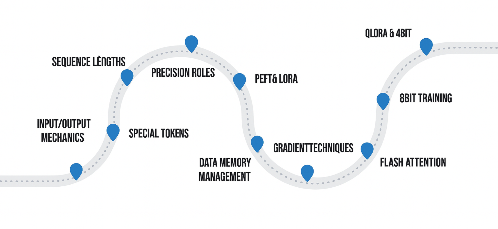

## Quick Navigation

- [Introductory Concepts for Scale Training](#introductory-concepts-for-scale-training)
- [Understanding DeepSpeed Theoretically](#understanding-deepspeed-theoretically)
- [Implementing DeepSpeed Practically](#implementing-deepspeed-practically)
- [Fully Sharded Data Parallel (FSDP) Theoretical Insights](#fully-sharded-data-parallel-fsdp-theoretical-insights)
- [Applying FSDP in Practice](#applying-fsdp-in-practice)
- [Conclusion](#course-conclusion-and-future-directions)


---

## Introductory Concepts for Scale Training


## Quick Navigation

- [Introduction to Multi-GPU Scaling](#introduction-to-multi-gpu-scaling)
- [Why Scaling is Necessary](#why-scaling-is-necessary)
- [Strategic Goals of Scaling](#strategic-goals-of-scaling)
- [From Optimization to Hardware Expansion](#from-optimization-to-hardware-expansion)
- [Preview of Scaling Frameworks](#preview-of-scaling-frameworks)
- [References & Further Reading](#references--further-reading)

---

## Introduction to Multi-GPU Scaling

In this final section, we shift our focus from single-machine optimization to **scaling across multiple GPUs or nodes**. While techniques such as quantization, LoRA, and flash attention helped maximize limited resources, we now explore strategies that increase total computational power by adding hardware.

[Back to Top](#quick-navigation)

---

## Why Scaling is Necessary

Scaling allows us to break free from the physical constraints of a single GPU. There are two primary motivations for doing so:

- **Training larger models**: Eventually, no matter how optimized, a model won't fit into GPU memory.
- **Faster training**: Even for smaller models, scaling enables faster iteration and experimentation by parallelizing the training workload.

State-of-the-art LLMs (like GPT-4, Gemini, Claude) are trained across **hundreds to thousands of GPUs simultaneously**.

[Back to Top](#quick-navigation)

---

## Strategic Goals of Scaling

Scaling isn’t only about “going bigger.” It’s also about going **faster**, or both.

- **Goal 1**: Train **larger models** that wouldn't fit in memory otherwise.
- **Goal 2**: Train **faster**, reducing the time per epoch or iteration.
- **Hybrid Goal**: Train **moderately larger models faster**, using distributed compute efficiently.

🔁 The balance between size, speed, and hardware availability guides the scaling strategy.

[Back to Top](#quick-navigation)

---

## From Optimization to Hardware Expansion

Previously, we relied on:
- 4-bit quantization
- Flash Attention
- QLoRA
- Efficient batch and sequence tuning

These **maximize utilization of a single GPU**, often squeezing 27B+ parameter models into 24GB cards.

Now, we explore **hardware scaling**, where:
- Multiple GPUs share memory and gradient updates
- Compute is parallelized for greater throughput

This introduces complexity in terms of synchronization, communication overhead, and model sharding, but unlocks **next-level capabilities**.

[Back to Top](#quick-navigation)

---

## Preview of Scaling Frameworks

We will explore and compare two major frameworks for distributed LLM training:

1. **DeepSpeed** (by Microsoft):
   - Efficient training of very large models
   - Includes ZeRO optimizer and communication-efficient primitives

2. **Fully Sharded Data Parallel (FSDP)** (by PyTorch):
   - Parameter, gradient, and optimizer sharding
   - Native PyTorch integration with strong memory savings

Both frameworks enable:
- Multi-GPU training
- Reduced memory load per device
- High-speed training with scalable architecture

Next, we begin hands-on work with **DeepSpeed**.

[Back to Top](#quick-navigation)

---

## References & Further Reading

- [DeepSpeed GitHub](https://github.com/microsoft/DeepSpeed)
- [DeepSpeed Docs](https://www.deepspeed.ai/)
- [FSDP Documentation – PyTorch](https://pytorch.org/docs/stable/fsdp.html)
- [ZeRO Redundancy Optimizer (ZeRO)](https://arxiv.org/abs/1910.02054)
- [Scaling Laws for Neural Language Models](https://arxiv.org/abs/2001.08361)
- [Accelerating Training with Flash Attention](https://arxiv.org/abs/2205.14135)
- [LoRA and QLoRA Papers](https://arxiv.org/abs/2305.14314)

 


[Back to Top](#quick-navigation)

---

## Understanding DeepSpeed Theoretically


## Quick Navigation

- [What is DeepSpeed](#what-is-deepspeed)
- [Why Use DeepSpeed](#why-use-deepspeed)
- [ZeRO Optimization Stages](#ZeRO-optimization-stages)
- [Comparison of ZeRO Stages](#comparison-of-ZeRO-stages)
- [When to Use Each Stage](#when-to-use-each-stage)
- [References & Further Reading](#references--further-reading)

---

## What is DeepSpeed

**DeepSpeed** is an open-source deep learning optimization library developed by Microsoft. It is designed to:
- Speed up training
- Enable training of very large models
- Efficiently utilize multiple GPUs through advanced parallelization strategies

Key features include:
- Model parallelism
- Gradient and parameter partitioning
- Memory and compute optimizations

[Back to Top](#quick-navigation)

---

## Why Use DeepSpeed

DeepSpeed is built for high-scale model training. It helps:
- Distribute models across multiple GPUs
- Lower memory footprint per GPU
- Improve throughput in both research and production-scale workloads

It is ideal for:
- Training large LLMs efficiently
- Use cases where hardware and time are critical resources

[Back to Top](#quick-navigation)

---

## ZeRO Optimization Stages

The core innovation of DeepSpeed is the **ZeRO (ZeRO Redundancy Optimizer)** framework, which is broken down into three stages:

### Stage 1: ZeRO-1
- Partitions optimizer states across GPUs
- Provides slight memory savings
- Fastest among all stages

### Stage 2: ZeRO-2
- Partitions both optimizer states and gradients
- Reduces memory load further
- Slower than ZeRO-1 due to added overhead

### Stage 3: ZeRO-3
- Partitions optimizer states, gradients, and model parameters
- Offers maximum memory savings
- Slowest stage due to high communication overhead

[Back to Top](#quick-navigation)

---

## Comparison of ZeRO Stages

| Stage     | Speed       | Memory Efficiency | Components Partitioned                         |
|-----------|-------------|-------------------|------------------------------------------------|
| ZeRO-1    | 🟢 Fastest  | 🔴 Lowest          | Optimizer states                               |
| ZeRO-2    | 🟡 Moderate | 🟡 Moderate        | Optimizer states + Gradients                   |
| ZeRO-3    | 🔴 Slowest  | 🟢 Highest         | Optimizer states + Gradients + Model Parameters|

[Back to Top](#quick-navigation)

---

## When to Use Each Stage

- **ZeRO-1**: Use when training time is the main constraint and memory is not a major issue.
- **ZeRO-2**: Use when training moderately large models with balanced speed/memory tradeoff.
- **ZeRO-3**: Use when maximum model size is required, even at the cost of training speed.

These stages give developers flexibility to choose based on their needs and available hardware.

[Back to Top](#quick-navigation)

---

## References & Further Reading

- [DeepSpeed GitHub](https://github.com/deepspeedai/DeepSpeed)
- [ZeRO Paper – Optimizer Redundancy Elimination](https://arxiv.org/abs/1910.02054)
- [DeepSpeed Documentation](https://www.deepspeed.ai/)
- [PyTorch FSDP Docs (for comparison)](https://pytorch.org/docs/stable/fsdp.html)
- [Efficient Training Techniques by Microsoft](https://www.microsoft.com/en-us/research/blog/deepspeed-extreme-scale-model-training-and-inference/)

[Back to Top](#quick-navigation)

--

---

## Implementing DeepSpeed Practically


## Quick Navigation

- [Setting Up the Environment](#setting-up-the-environment)
- [Training LLaMA 3-8B Without DeepSpeed](#training-llama-3-8b-without-deepspeed)
- [Enabling DeepSpeed Integration](#enabling-deepspeed-integration)
- [Running Training on Multiple GPUs](#running-training-on-multiple-gpus)
- [ZeRO-1 JSON Configuration](#ZeRO-1-json-configuration)
- [DeepSpeed Training YAML Configuration](#deepspeed-training-yaml-configuration)
- [Colab Notebook](#colab-notebook)
- [References & Further Reading](#references--further-reading)

---

## Setting Up the Environment

In this lesson, we apply DeepSpeed practically to train the `Meta-LLaMA-3.1-8B-Instruct` model using two GPUs.  
The goal is to optimize **training speed** rather than memory efficiency.

- Starting from an Axolotl-based setup
- Using the SQuAD dataset
- Measuring single-GPU vs. multi-GPU time comparisons

[Back to Top](#quick-navigation)

---

## Training LLaMA 3-8B Without DeepSpeed

Initial benchmark:
- Run on **1 GPU**
- Training time: ~1 hour 40 minutes
- CUDA visibility set to restrict GPU usage
- Dataset: `squad-for-llms`
- Model: `Meta-LLaMA-3.1-8B-Instruct`

This baseline helps quantify the gains from enabling DeepSpeed later.

[Back to Top](#quick-navigation)

---

## Enabling DeepSpeed Integration

DeepSpeed support is built into Axolotl. It provides default JSON configs for:
- ZeRO-1
- ZeRO-2
- ZeRO-3

### How to Enable:
1. Copy the desired config (e.g., `ZeRO1.json`) from [Axolotl DeepSpeed Configs](https://github.com/axolotl-ai-cloud/axolotl/tree/main/deepspeed_configs)
2. Set it in your training command via `deepspeed` parameter
3. Launch Axolotl with multiple GPUs (remove `CUDA_VISIBLE_DEVICES` restriction)

```bash
CUDA_VISIBLE_DEVICES=0,1 accelerate launch train.py --deepspeed=ZeRO1.json ...
```

🟢 Outcome: Multi-GPU training initiated with backend set to DeepSpeed

[Back to Top](#quick-navigation)

---

## Running Training on Multiple GPUs

- Training is re-launched using both GPUs
- ZeRO-1 stage selected (focused on speed, not memory saving)
- Each GPU runs a **full copy** of the model
- Results:
  - New training time: ~1 hour
  - ~40% speed improvement with 2 GPUs

🔁 Although not linear, the scaling is significant and useful in production and experimentation workflows.

[Back to Top](#quick-navigation)

---

## ZeRO-1 JSON Configuration

```json
{
  "ZeRO_optimization": {
    "stage": 1,
    "overlap_comm": true
  },
  "bf16": {
    "enabled": "auto"
  },
  "fp16": {
    "enabled": "auto",
    "auto_cast": false,
    "loss_scale": 0,
    "initial_scale_power": 32,
    "loss_scale_window": 1000,
    "hysteresis": 2,
    "min_loss_scale": 1
  },
  "gradient_accumulation_steps": "auto",
  "gradient_clipping": "auto",
  "train_batch_size": "auto",
  "train_micro_batch_size_per_gpu": "auto",
  "wall_clock_breakdown": false
}
```

[Back to Top](#quick-navigation)

---

## DeepSpeed Training YAML Configuration

```yaml
base_model: unsloth/Meta-Llama-3.1-8B-Instruct

datasets:
  - path: TheFuzzyScientist/squad-for-llms
    type: 
      system_prompt: "Read the following context and concisely answer my question."
      field_system: system
      field_instruction: question
      field_input: context
      field_output: output
      format: "<|user|>\n {input} {instruction} </s>\n<|assistant|>"
      no_input_format: "<|user|> {instruction} </s>\n<|assistant|>"

output_dir: ./models/Llama3_squad

sequence_length: 2048
bf16: auto
tf32: false
micro_batch_size: 4
num_epochs: 4
optimizer: adamw_bnb_8bit
learning_rate: 0.0002
logging_steps: 1

adapter: lora
lora_r: 32
lora_alpha: 16
lora_dropout: 0.05
lora_target_linear: true
gradient_accumulation_steps: 1
gradient_checkpointing: true
```

[Back to Top](#quick-navigation)

---

## Colab Notebook

👉 [Open in Colab](https://colab.research.google.com/drive/1Uau3HzU3tVnhfeAK1fVpypbKoTrETDNK?usp=sharing)  
[](https://colab.research.google.com/drive/1Uau3HzU3tVnhfeAK1fVpypbKoTrETDNK?usp=sharing)

[Back to Top](#quick-navigation)

---

## References & Further Reading

- [DeepSpeed GitHub](https://github.com/deepspeedai/DeepSpeed)
- [Axolotl DeepSpeed Configs](https://github.com/axolotl-ai-cloud/axolotl/tree/main/deepspeed_configs)
- [Hugging Face DeepSpeed Guide](https://huggingface.co/docs/accelerate/en/usage_guides/deepspeed)
- [ZeRO Optimizer Paper](https://arxiv.org/abs/1910.02054)
- [Axolotl Project](https://github.com/OpenAccess-AI-Collective/axolotl)
- [SQuAD Dataset – Hugging Face](https://huggingface.co/datasets/squad)

[Back to Top](#quick-navigation)

 


## Fully Sharded Data Parallel (FSDP) Theoretical Insights

## 📌 Quick Navigation

- [## 1. Overview of FSDP](#1-overview-of-fsdp)
- [## 2. Why FSDP Over DDP?](#2-why-fsdp-over-ddp)
- [## 3. Sharding Strategies in FSDP](#3-sharding-strategies-in-fsdp)
- [## 4. Model Comparison: FSDP vs ZeRO](#4-model-comparison-fsdp-vs-zero)
- [## 5. When to Use FSDP](#5-when-to-use-fsdp)
- [## References & Further Reading](#references--further-reading)

---

## 1. Overview of FSDP

**FSDP (Fully Sharded Data Parallel)** is a PyTorch-native distributed training framework developed by Meta AI. It's designed for **efficient memory usage and scalability** while training large models—especially LLMs.

- Origin: Introduced by Meta within the PyTorch ecosystem.
- Key Use: Enables models too large for single GPU memory.
- Core Idea: Shard model weights, gradients, and optimizer states across multiple GPUs.

🧩 **Main Capabilities:**

- Memory-efficient training via model sharding.
- Smart offloading of model shards between GPU and CPU.
- Compatible with massive models (GPT-like, BERT variants).
- Reduces per-GPU memory footprint → supports larger batch sizes.

[Back to Top](#quick-navigation)

---

## 2. Why FSDP Over DDP?

| Technique | Replicates Model | Memory Pooling | Model Size Suitability | Use Case |
|----------|------------------|----------------|-------------------------|----------|
| DDP (Distributed Data Parallel) | ✅ Full model replicated | ❌ No memory pooling | Medium | Speed-focused training |
| FSDP | ❌ Fully sharded | ✅ Memory-efficient | Large-scale | Training LLMs beyond single GPU |

🔍 Unlike DDP, FSDP:
- Does **not** replicate the full model.
- **Shards** weights across GPUs.
- Optimizes **both training speed and memory usage**.

[Back to Top](#quick-navigation)

---

## 3. Sharding Strategies in FSDP

FSDP provides 4 sharding strategies, similar in spirit to ZeRO stages (used by DeepSpeed):

### 🔵 No Sharding

- Equivalent to DDP.
- No memory savings.
- Fastest strategy (lowest overhead).
- Use if memory isn’t a bottleneck.

### 🟡 Gradients & Optimizer Sharding (Similar to ZeRO Stage 2)

- Gradients and optimizer states are sharded.
- Parameters still replicated.
- Balanced trade-off between speed and memory.

### 🟢 Hybrid Sharding

- Shards parameters + optimizer states.
- Maintains full copy of model on each GPU for fast inference.
- Best for scenarios with frequent inference and evaluation needs.

### 🔴 Full Sharding (Similar to ZeRO Stage 3)

- Shards everything: parameters, gradients, optimizer states.
- Best memory efficiency.
- Ideal for very large models.
- Adds communication overhead → may slow down training.

📊 **Sharding Strategy Comparison Table:**

| Strategy | Parameters | Gradients | Optimizer | Memory Efficient | Fast Inference | Best For |
|----------|------------|-----------|-----------|------------------|----------------|----------|
| No Shard | ❌ | ❌ | ❌ | 🔴 | 🟢 | Small models |
| Grad+Opt | ❌ | ✅ | ✅ | 🟡 | 🟡 | Balanced setup |
| Hybrid   | ✅ | ✅ | ✅ | 🟢 | 🟢 | Training + eval |
| Full     | ✅ | ✅ | ✅ | 🟢🟢🟢 | 🔴 | Huge models |

[Back to Top](#quick-navigation)

---

## 4. Model Comparison: FSDP vs ZeRO

| Feature | FSDP | ZeRO (DeepSpeed) |
|--------|------|------------------|
| Native to | PyTorch | DeepSpeed/ONNX |
| Sharding Levels | Full | Stage 1 to 3 |
| CPU Offloading | ✅ | ✅ |
| Model-Agnostic | ✅ | ✅ |
| Hardware Compatibility | Any PyTorch GPU setup | Azure/AWS optimized |
| Supported Community | Meta AI | Microsoft |

🔎 FSDP has tighter PyTorch integration, making it easier for native PyTorch workflows.

📎 [FSDP on Hugging Face](https://huggingface.co/docs/accelerate/usage_guides/fsdp)
📄 [FSDP ArXiv Paper](https://arxiv.org/abs/2210.06628)

[Back to Top](#quick-navigation)

---

## 5. When to Use FSDP

🏁 **Best suited when:**

- You're training models with billions of parameters.
- GPU memory is insufficient for full-model replication.
- You need to scale across 4+ GPUs with low memory usage.
- You want fine-grained control over training memory behavior.

🚩 **Not necessary when:**

- Models fit easily on a single GPU.
- Training speed is more important than memory savings.

🧠 Bonus: Even without full sharding, FSDP helps reduce memory usage to allow **larger batch sizes**.

[Back to Top](#quick-navigation)

---

 

## References & Further Reading

- [📄 FSDP: Fully Sharded Data Parallel Training (ArXiv)](https://arxiv.org/abs/2210.06628)  
  The original research paper introducing FSDP, explaining its architecture, design rationale, and performance benchmarks.

- [🧪 Hugging Face Accelerate: FSDP Training Guide](https://huggingface.co/docs/accelerate/usage_guides/fsdp)  
  Practical guidance on using FSDP with Hugging Face's Accelerate library for distributed training.

- [📘 PyTorch FSDP Tutorial (Official)](https://pytorch.org/tutorials/intermediate/FSDP_tutorial.html)  
  Step-by-step code tutorial from the PyTorch team demonstrating how to use `torch.distributed.fsdp`.

- [💬 Meta AI Engineering Blog](https://engineering.fb.com)  
  Technical blog posts by Meta on distributed training innovations, including the development of FSDP.

- [🧠 NVIDIA Megatron-LM](https://github.com/NVIDIA/Megatron-LM)  
  One of the earliest large-scale model training toolkits that inspired advances in sharded training techniques.

- [💻 DeepSpeed ZeRO Documentation (Microsoft)](https://www.deepspeed.ai/tutorials/zero/)  
  Deep dive into ZeRO stages 1–3, which parallel FSDP's sharding strategies in philosophy and effect.

- [🎥 YouTube – Scaling Transformers with FSDP (Meta AI)](https://www.youtube.com/watch?v=FZs7-vP3L3I)  
  Video walkthrough of how FSDP works and how it's applied in production-scale transformer training.

- [📚 Microsoft ZeRO-3 Optimization Paper](https://arxiv.org/abs/1910.02054)  
  Foundational paper on memory-optimized training with ZeRO, useful for comparing against FSDP.

[Back to Top](#quick-navigation)


 

---

## Applying FSDP in Practice


## 📌 Quick Navigation
- [Course Overview](#course-overview)
- [Hardware Setup](#hardware-setup)
- [Configuration for Training](#configuration-for-training)
- [FSDP Setup](#fsdp-setup)
- [Training Execution](#training-execution)
- [Reflections & Takeaways](#reflections--takeaways)
- [References & Further Reading](#references--further-reading)

## Course Overview

In this session, we train the **LLaMA 3 - 70B** model using **Fully Sharded Data Parallelism (FSDP)** with **QLoRA** support on NVIDIA GPUs. The aim is to enable fine-tuning such a massive model efficiently using limited hardware (2 x NVIDIA L4 GPUs).

- Model: LLaMA 3 - 70B
- Framework: Axolotl
- Parallelism Strategy: Fully Sharded Data Parallel (FSDP)
- Quantization: 4-bit QLoRA
- GPUs used: 2 x NVIDIA L4 (24GB each)
- Cost: ~$2/hr via RunPod

[Back to Top](#quick-navigation)

## Hardware Setup

- Initial RTX 4090 setup was dropped due to poor inter-GPU communication.
- Replaced with NVIDIA L4s for better memory distribution.
- L4s provide equivalent VRAM (24GB) and are more optimal for sharded training.

[Back to Top](#quick-navigation)

## Configuration for Training

### Key Parameters

```yaml
base_model: casperhansen/llama-3-70b-fp16
datasets:
  - path: Yukang/LongAlpaca-12k
    type: alpaca
output_dir: ./models/llama70B-LongAlpaca
sequence_length: 1024
pad_to_sequence_len: true
special_tokens:
  pad_token: <|end_of_text|>
optimizer: adamw_torch
micro_batch_size: 1
num_epochs: 1
learning_rate: 0.0002
adapter: qlora
load_in_4bit: true
flash_attention: true
```

- Switched from Adam8bit to `adamw_torch` for FSDP compatibility.
- Used `pad_to_sequence_len` and specified padding tokens for uniform batch processing.
- LoRA & quantization settings enable memory efficiency for 70B models.

👉 [Open in Colab](https://colab.research.google.com/drive/1ayCPAZ9ysyPBxMnlT-XmvFxyF0k6jQOi?usp=sharing)  
<a href="https://colab.research.google.com/drive/1ayCPAZ9ysyPBxMnlT-XmvFxyF0k6jQOi?usp=sharing"></a>

[Back to Top](#quick-navigation)

## FSDP Setup

### Configuration

```yaml
fsdp:
  - full_shard
  - auto_wrap
fsdp_config:
  fsdp_offload_params: true
  fsdp_cpu_ram_efficient_loading: true
  fsdp_state_dict_type: FULL_STATE_DICT
  fsdp_transformer_layer_cls_to_wrap: LlamaDecoderLayer
```

- Enabled `cpu_ram_efficient_loading` to reduce active memory use.
- Used `FULL_STATE_DICT` for complete checkpoint saving.
- `auto_wrap` and `full_shard` ensures correct layer partitioning for LLaMA's decoder.

[Hugging Face Docs on FSDP](https://huggingface.co/docs/accelerate/en/usage_guides/fsdp)

[Back to Top](#quick-navigation)

## Training Execution

- Axolotl script starts loading and quantizing the massive model (150GB in FP16).
- First-time load may take up to 40 minutes.
- Each GPU receives a different shard of the model.
- Memory utilization is optimized, loading only actively used weights.
- Training is slow but feasible with 4-bit quantization and FSDP+QLoRA.

🟢 Success: Fine-tuning a 70B LLM on only 2 x 24GB GPUs  
🔴 Tradeoff: Long training times

[Back to Top](#quick-navigation)

## Reflections & Takeaways

- Demonstrates the power of modern tooling (Axolotl, FSDP, QLoRA).
- Scaling large models is possible without massive GPU clusters.
- Careful configuration of optimizer, batch size, memory usage, and quantization is key.
- Offers a hands-on blueprint for scaling up model training workflows.

[Back to Top](#quick-navigation)

## References & Further Reading

- [LLaMA 3 Hugging Face Card](https://huggingface.co/casperhansen/llama-3-70b-fp16)
- [Axolotl GitHub](https://github.com/OpenAccess-AI-Collective/axolotl)
- [FSDP Docs – Hugging Face Accelerate](https://huggingface.co/docs/accelerate/en/usage_guides/fsdp)
- [RunPod – GPU rentals](https://www.runpod.io/)
- [QLoRA Paper (arXiv)](https://arxiv.org/abs/2305.14314)
- [LoRA: Low-Rank Adaptation of LLMs](https://arxiv.org/abs/2106.09685)
- [Meta’s LLaMA 3 Overview](https://ai.meta.com/blog/meta-llama-3/)

--

[Back to Top](#quick-navigation)

---

## Conclusion

## 📌 Quick Navigation
- [Course Reflection & Summary](#course-reflection--summary)
- [Section 1: Foundations of LLMs](#section-1-foundations-of-llms)
- [Section 2: Preparing for Training](#section-2-preparing-for-training)
- [Section 3: Advanced Training Techniques](#section-3-advanced-training-techniques)
- [Section 4: Specialized LLM Techniques](#section-4-specialized-llm-techniques)
- [Section 5: Scaling LLM Training](#section-5-scaling-llm-training)
- [Section 6: Final Roadmap](#section-6-final-roadmap)
- [References & Further Reading](#references--further-reading)

---

## Course Reflection & Summary

This final lesson encapsulates our comprehensive journey through large language models (LLMs) and generative AI. From foundational knowledge to advanced techniques, each section provided practical, actionable insights for building and deploying LLMs.

[Back to Top](#📌quick-navigation)

---

## Section 1: Foundations of LLMs

### Topics Covered:
- Understanding LLM mechanics and generation
- Reinforcement Learning with Human Feedback (RLHF)
- Input/output architecture of LLMs
- Chat template construction for structured interactions
- Model selection frameworks for different use cases
- Techniques to guide and optimize model outputs

### Real-World Use Case:
Fine-tuning a chatbot to deliver consistent customer service responses using structured prompts.

[Back to Top](#📌quick-navigation)

---

## Section 2: Preparing for Training

### Key Concepts:
- Impact of sequence length on model efficiency
- Token count intuition and compression
- Numerical precision trade-offs (FP32, FP16, BF16)
- Hands-on basics of LLM training setups

### Tools:
- Tokenizers from Hugging Face
- Tensor precision profiling with PyTorch

### Use Case:
Training a document summarization model using low-bit precision and optimized token lengths.

[Back to Top](#📌quick-navigation)

---

## Section 3: Advanced Training Techniques

### Covered Topics:
- Training bottlenecks in memory and compute
- Parameter Efficient Fine-Tuning (PEFT) & LoRA
- Gradient accumulation & checkpointing strategies
- Adapter merging and LoRA evaluations


[Back to Top](#📌quick-navigation)

---

## Section 4: Specialized LLM Techniques

### Techniques Explored:
- 8-bit training for resource efficiency
- Task-specific output learning
- Flash Attention for memory-constrained GPUs
- 4-bit quantization with QLoRA

### Colab Link:
👉 [Open in Colab](https://colab.research.google.com/github/huggingface/peft/blob/main/examples/qlora/qlora_training.ipynb)

[](https://colab.research.google.com/github/huggingface/peft/blob/main/examples/qlora/qlora_training.ipynb)

### ArXiv Reference:
- [QLoRA: Efficient Finetuning of Quantized LLMs](https://arxiv.org/abs/2305.14314)

[Back to Top](#📌quick-navigation)

---

## Section 5: Scaling LLM Training

### Focus Areas:
- Multi-GPU model training
- DeepSpeed integration
- Fully Sharded Data Parallelism (FSDP)

### Technologies:
- [DeepSpeed GitHub](https://github.com/microsoft/DeepSpeed)
- [FSDP Docs](https://pytorch.org/blog/introducing-pytorch-fully-sharded-data-parallel-api/)

### Use Case:
Deploying GPT-like models across A100 clusters using DeepSpeed + FSDP for enterprise-scale tasks.

[Back to Top](#📌quick-navigation)


---

## Section 6: Final Roadmap:


> 

---

## References & Further Reading

- [Hugging Face Transformers Docs](https://huggingface.co/docs/transformers/index)
- [OpenAI Cookbook](https://github.com/openai/openai-cookbook)
- [LoRA: Parameter Efficient Fine-Tuning](https://arxiv.org/abs/2106.09685)
- [DeepSpeed](https://www.deepspeed.ai/)
- [FlashAttention Paper](https://arxiv.org/abs/2205.14135)
- [QLoRA: Quantization for LLMs](https://arxiv.org/abs/2305.14314)
- [Microsoft FSDP](https://pytorch.org/blog/introducing-pytorch-fully-sharded-data-parallel-api/)
- [XAI Research](https://xai.org/research)

---


---

[Back to Top](#quick-navigation)

---


⬅️ **Previous:** [Specialized LLM Training](11-llm-specialized.md)  
 