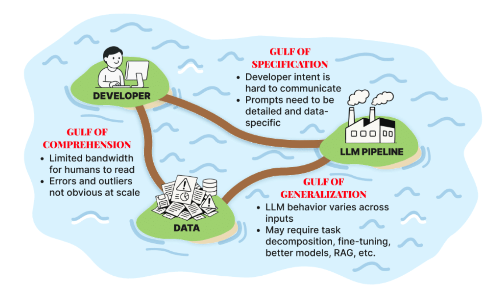
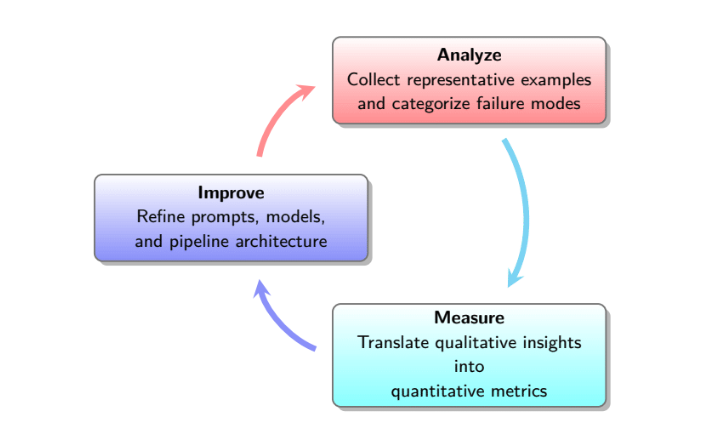

# 📘 Chapter Summary: LLMs, Prompts, and Evaluation Basics

## 📌 Quick Navigation

- [1. Introduction](#1-introduction)
- [1.1 What is Evaluation?](#11-what-is-evaluation)
- [1.2 The Three Gulfs of LLM Pipeline Development](#12-the-three-gulfs-of-llm-pipeline-development)
- [1.3 Why LLM Pipeline Evaluation is Challenging](#13-why-llm-pipeline-evaluation-is-challenging)
- [1.4 The LLM Evaluation Lifecycle: Bridging the Gulfs with Evaluation](#14-the-llm-evaluation-lifecycle-bridging-the-gulfs-with-evaluation)
- [1.5 Summary](#15-summary)
- [2.1 Strengths and Weaknesses of LLMs](#21-strengths-and-weaknesses-of-llms)
- [2.2 Prompting Fundamentals](#22-prompting-fundamentals)
- [2.3 Defining “Good”: Types of Evaluation Metrics](#23-defining-good-types-of-evaluation-metrics)
- [2.4 Foundation Models vs. Application-Centric Evals](#24-foundation-models-vs-application-centric-evals)
- [2.5 Eliciting Labels for Metric Computation](#25-eliciting-labels-for-metric-computation)
- [2.6 Summary](#26-summary)
- [2.7 Glossary of Terms](#27-glossary-of-terms)
- [2.8 Exercises](#28-exercises)
- [2.8.4 Eliciting Labels (Travel Assistant)](#284-eliciting-labels-travel-assistant)
- [Shankar et al 2024 2024d](#shankar-et-al-2024-2024d)
- [Bommasani et al 2021 and Zaharia et al 2024](#bommasani-et-al-2021-and-zaharia-et-al-2024)
- [Ward and Feldstein 2024 Status Analysis](#ward-and-feldstein-2024-status-analysis)
- [Lian et al 2023 2025 Generative Foundation Models Handbook](#lian-et-al-2023-2025-generative-foundation-models-handbook)
- [Hendrycks et al 2021 Unsolved Problems in ML Safety](#hendrycks-et-al-2021-unsolved-problems-in-ml-safety)
- [Rein et al 2024 Status Relevant Findings](#rein-et-al-2024-status-relevant-findings)
- [Jain et al 2025 Status Related Works](#jain-et-al-2025-status-related-works)
---

[🔼 Back to Top](#quick-navigation)

## 1. Introduction

Rapid advances in the development and deployment of LLMs are reshaping applications such as customer service, decision support, and information extraction (Bommasani et al. 2021; Zaharia et al. 2024). However, their adoption outpaces our ability to systematically evaluate them (Ward and Feldstein 2024).

Unlike traditional deterministic software, LLM pipelines yield subjective and context-sensitive outputs. This introduces challenges in evaluation, as conventional metrics like accuracy or F1 score may not apply.

**Core challenge:** How do we evaluate whether an LLM pipeline is performing correctly, and where it might be failing?

[🔼 Back to Top](#quick-navigation)

## 1.1 What is Evaluation?

**Evaluation** is defined as the systematic measurement of LLM pipeline quality. Evaluations can be:

- **Background Monitoring** – passive observation for drift or degradation.
- **Guardrails** – checks that block/alter unsafe outputs.
- **Improvement Tools** – used to improve data labeling, few-shot examples, or prompt design.

Evaluations guide systematic improvements by identifying failure modes, enabling trust, safety, and ongoing enhancement.

[🔼 Back to Top](#quick-navigation)

## 1.2 The Three Gulfs of LLM Pipeline Development

This framework (Shankar et al. 2025; Norman, 1988) captures the key gaps:

- **Gulf of Comprehension**: Understanding input data and pipeline behavior.
- **Gulf of Specification**: Miscommunication between developer intent and prompt execution.
- **Gulf of Generalization**: Inconsistent LLM responses across different inputs.

> 

> Example: An email processing pipeline that misidentifies a public figure as a sender showcases a generalization failure.

[🔼 Back to Top](#quick-navigation)

## 1.3 Why LLM Pipeline Evaluation is Challenging

Challenges include:

- The **Three Gulfs** resurface uniquely for each task and dataset.
- Evaluation requirements evolve with usage.
- **No universal metric** exists; appropriate ones must be developed per context.
- **Benchmarks** don't capture task-specific failure modes.
- Ground-truth inspection is still necessary for effective evaluations (Shankar et al. 2024d).

[🔼 Back to Top](#quick-navigation)

## 1.4 The LLM Evaluation Lifecycle: Bridging the Gulfs with Evaluation

We adopt a structured approach:
``Analyze → Measure → Improve``

- **Analyze**: Inspect data and behavior to identify comprehension and specification issues.
- **Measure**: Use evaluators to quantitatively assess failure modes.
- **Improve**: Use findings to refine prompts, architectures, or training methods.

> This iterative loop builds reliable and evolving LLM systems.

> 

[🔼 Back to Top](#quick-navigation)

## 1.5 Summary

- Evaluation is essential for reliable LLMs.
- The Three Gulfs help diagnose sources of failure.
- Metrics must be context-specific and evolve with the system.
- The Analyze–Measure–Improve lifecycle provides a repeatable framework.

[🔼 Back to Top](#quick-navigation)

## 2.1 Strengths and Weaknesses of LLMs

- **Strengths**: LLMs produce fluent, coherent, grammatically correct text; excel in summarization, translation, editing, etc.
- **Weaknesses**:
  - Limited algorithmic generalization (Qian et al., 2022)
  - Effective context window smaller than expected (Li et al., 2024)
  - Prompt sensitivity (Sclar et al., 2024)
  - Probabilistic output = inconsistent results
  - Hallucination risk (Kalai & Vempala, 2024)

> 📌 **Key Takeaway 2.1**: Treat LLMs as powerful but fallible tools—leverage their strengths while anticipating weaknesses.

[🔼 Back to Top](#quick-navigation)
---

## 2.2 Prompting Fundamentals
 
A good prompt includes:
1. **Role and Objective** – Define persona and goal  
2. **Instructions** – Clear, bullet-form directives  
3. **Context** – Include text, data, background  
4. **Examples** – Few-shot guidance  
5. **Reasoning Steps** – CoT (Chain of Thought)  
6. **Formatting Constraints** – JSON, paragraph, etc.  
7. **Delimiters & Structure** – Markdown headers, tags  

[🔼 Back to Top](#quick-navigation)
---

## 2.3 Defining “Good”: Types of Evaluation Metrics

- **Reference-Based**: Compare output to gold labels  
  - Exact match, keyword check, SQL execution  
- **Reference-Free**: Evaluate quality without gold labels  
  - Validity of code, absence of hallucination, stylistic adherence  
  - Examples: LLM-generated API response uses valid schema  

[🔼 Back to Top](#quick-navigation)
---

## 2.4 Foundation Models vs. Application-Centric Evals

- **Foundation Eval**: Benchmarks like MMLU (Hendrycks et al., 2021), HELM, GSM8k  
- **Application Eval**: Tailored to specific pipeline goals like legal document fidelity  

> 💡 Tip: Don’t blindly trust benchmarks—build evals for your specific pipeline.

---

## 2.5 Eliciting Labels for Metric Computation

- **Direct Grading**: Human/LLM scoring using rubric  
- **Pairwise Comparison**: A vs B  
- **Ranking**: A > B > C based on rubric dimension  

> 📌 **Key Takeaway 2.2**: Combine direct grading, pairwise, and ranking for rich feedback.

[🔼 Back to Top](#quick-navigation)
---

## 2.6 Summary

This chapter presents a comprehensive framework for evaluating LLMs, emphasizing:
- Prompt design fundamentals  
- Reference-based vs reference-free metrics  
- Foundation vs application evaluations  
- Label elicitation techniques (grading, ranking)  

---

## 2.7 Glossary of Terms

- **LLM**: Large Language Model  
- **Foundation Model**: Pretrained for general use  
- **Token**: Unit of language  
- **Prompt**: Instructional input  
- **Attention**: Focus mechanism in Transformers  
- **SFT/RLHF/DPO**: Post-training strategies  

[🔼 Back to Top](#quick-navigation)
---

## 2.8 Exercises

### 1. Prompt Engineering
- Zero-shot: “Summarize the following email…”  
- One-shot: Add example email and response  

### 2. Metric Classification
- a: Reference-based  
- b: Reference-free  
- c: Reference-based  
- d: Reference-free  

### 3. Eval Types
- a: MMLU  
- b: Rate summaries using legal domain reviewers  

[🔼 Back to Top](#quick-navigation)

### 2.8.4 Eliciting Labels (Travel Assistant)

You need to evaluate whether a travel assistant’s flight recommendations respect the user’s budget constraint.

#### (a) Direct-Grading Rubric:
- **Within Budget**: All suggested flights have price ≤ user's maxPrice.  
- **Over Budget**: At least one suggested flight exceeds the user's maxPrice.  

#### (b) Pairwise-Comparison Instruction:

**Sample Prompt**:
> You are given a user query: "Find flights under $300 from JFK to LAX."  
> You also have two lists of three flight options (A and B).  
> Choose which list better respects the budget constraint and reply with "A" or "B," followed by a one-sentence justification.

#### (c) When to Use:
- **Direct grading** is ideal when you need an absolute adherence rate and the criterion is unambiguous.  
- **Pairwise comparison** is preferable for borderline cases or when annotators find relative judgments easier than binary labels.  

[🔼 Back to Top](#quick-navigation)

## Shankar et al 2024 2024d

---

## 1. Shankar & Sim (2024/2025) – *Generative AI on the Loose: Impact of Improved AI and Expert Oversight on Knowledge Sharing*

### 📖 Overview  
This empirical study analyzes the interplay between **advanced GenAI systems (e.g. GPT‑4)** and **expert moderation**, exploring how their combination influences knowledge-sharing on platforms like Stack Overflow.

### 🧠 Core Findings
- Combining high-performing GenAI output with strict expert oversight **reduces content volume** but significantly **improves quality** and reliability.
- When moderation is relaxed, there's a surge in contributions—primarily lower-quality or hallucinated content.
- Insight on skill-level variations: novice users benefit most from expert moderation in maintaining quality.

### ⚙️ Methodology
- Natural experiment around GPT‑4 adoption and Stack Overflow policy changes.
- Mixed-method: measuring variations in content volume and quality across user skill tiers.

### 🎯 Implications
- GenAI alone cannot guarantee content quality; **moderation remains essential**, especially for novice contributors.
- Platform design decisions (e.g. moderation policies) significantly influence the effectiveness and trustworthiness of GenAI-generated content.

### 📄 Reference
- Shankar & Sim (June 2024 / Feb 2025 revision), SSRN: [Generative AI on the Loose](https://papers.ssrn.com/sol3/papers.cfm?abstract_id=4867815)

[🔼 Back to Top](#quick-navigation)

---

## 2. Shankar et al. (2024d) – Clarification

As of July 2025, no separate, clearly titled publication labeled *“Shankar et al. (2024d)”* is indexed under generative AI, LLMs, or AI safety literature. It is possible that:
- “2024d” refers to the **fourth revision or release** of the same “Generative AI on the Loose” paper.
- Or it refers to an internal or upcoming publication yet to be made public.

### ✅ Known Public Record
The Shankar & Sim (2024/2025) SSRN paper appears to be the most likely source being referenced.

---

## 📊 Summary Table

| Paper                         | Year       | Focus Area                      | Key Contribution                                      |
|------------------------------|------------|----------------------------------|-------------------------------------------------------|
| Shankar & Sim – GenAI Study  | 2024/2025  | GenAI adoption + moderation      | Expert oversight retains quality, even with GenAI     |
| Shankar et al. (2024d)       | 2024       | [Not Publicly Available]         | Possibly a revision alias of above                   |

---

## 🔗 Related Works  
- [SSRN – Shankar & Sim Paper](https://papers.ssrn.com/sol3/papers.cfm?abstract_id=4867815)
- [Rio-Chanona et al. (2023) – LLM Impact on Public Q&A](https://arxiv.org/abs/2307.07367)
- [Kabir et al. (CHI 2024) – Hallucinations in Code Answers](https://arxiv.org/abs/2308.02312)

---

## 📚 Further Reading  
- [Stanford HAI – AI Index 2025](https://hai.stanford.edu/ai-index/2025-ai-index-report)
- [Montreal AI Ethics Institute](https://montrealethics.ai)
- [Stack Overflow’s GenAI Policy Changes](https://stackoverflow.blog)

---

[🔼 Back to Top](#quick-navigation)

## Bommasani et al 2021 and Zaharia et al 2024

---

## 1. Bommasani et al. (2021) – *“On the Opportunities and Risks of Foundation Models”*

### 📖 Overview
This landmark Stanford report introduced the term **foundation models**, referring to large-scale models pretrained using self-supervised learning that can be adapted for a wide range of downstream tasks.

### 🧠 Key Contributions
- Defines the concept of *foundation models* (e.g., BERT, GPT‑3, CLIP).
- Highlights emergent behaviors and transfer capabilities across modalities.
- Warns of homogenization: risks when many applications rely on a shared base model.
- Urges the need for interdisciplinary study across ethics, policy, and technical design.

### ⚠️ Risks Highlighted
- Model biases and reinforcement of societal inequities.
- Lack of interpretability and safety mechanisms.
- Environmental cost of training large models.
- Over-centralization in model deployment and research.

### 🔍 Use Case Domains
- Education, healthcare, legal systems, and human-AI interaction.

### 📄 Reference
- [Bommasani et al., 2021 (arXiv)](https://arxiv.org/abs/2108.07258)

---

[🔼 Back to Top](#quick-navigation)

## 2. Zaharia et al. (2024) – *Compound AI Systems*

### 📖 Overview
This paper presents a structured framework for building **compound AI systems** — orchestration of LLMs, retrievers, tools, and planners to perform complex workflows beyond single-model prompting.

### 🧩 Core Architecture
- **Agents & Registries**: Interface to external tools, databases, models.
- **Streams**: Data and instruction flow between components.
- **Planners**: Optimize task decomposition and routing.

### 🚀 Key Advantages
- Enhances flexibility and modularity in AI applications.
- Reduces reliance on monolithic scaling.
- Faster iteration and lower inference costs.

### 🧪 Real-World Impacts
- Used in tool-augmented LLM agents, retrieval-augmented generation (RAG), and real-time business pipelines.

### 📄 Reference
- [Zaharia et al., 2024 (arXiv)](https://arxiv.org/abs/2406.00584)

---

[🔼 Back to Top](#quick-navigation)

## 📊 Comparison Table

| Paper / Concept                        | Year | Focus                                      | Core Idea                                                  | Strengths                                              | Challenges / Risks                          |
|---------------------------------------|------|--------------------------------------------|------------------------------------------------------------|--------------------------------------------------------|---------------------------------------------|
| *Bommasani et al.* (Foundation Models) | 2021 | Scale of LLMs and societal impact         | Large pretrained models adaptable across tasks              | Emergent abilities, transferability                    | Bias, homogenization, environmental & social risks |
| *Zaharia et al.* (Compound AI Systems) | 2024 | Multi-component AI orchestration systems  | Systems composed of agents, retrievers, planners, etc.       | Flexible, efficient, faster to deploy & iterate         | Complexity in coordination, quality control |

---

## 🔗 Further Reading

- [Foundation Models - Stanford CRFM](https://crfm.stanford.edu/)
- [Hugging Face Transformers](https://huggingface.co/docs/transformers/index)
- [Compound AI Systems Blog - BAIR](https://bair.berkeley.edu/blog/2024/02/18/compound-ai-systems/)
- [DeepSpeed GitHub](https://github.com/microsoft/DeepSpeed)

[🔼 Back to Top](#quick-navigation)

## Ward and Feldstein 2024 Status Analysis

---

### ❗ Summary
A direct publication titled **"Ward and Feldstein, 2024"** could not be located in the academic databases or preprint servers (e.g., arXiv) for generative AI or large language model research as of July 2025.

However, the following are two closely related works potentially referenced incorrectly or tangentially relevant:

---

## 1. Steven Feldstein – *AI Governance & Surveillance*

### 📖 Overview
Steven Feldstein is known for his extensive research on the global political implications of AI, focusing on surveillance technologies and digital repression.

### 🧠 Key Concepts
- Impact of AI on authoritarian governance and digital human rights.
- Role of international regulations and national policies in curbing abuse.
- Ethical limits of algorithmic surveillance and social scoring.

### 📄 Related Reading
- [Brookings Institution - AI and Digital Authoritarianism](https://www.brookings.edu/experts/steven-feldstein/)
- [Journal articles on AI governance and policy](https://arxiv.org/search/?searchtype=author&query=Feldstein%2C+S)

[🔼 Back to Top](#quick-navigation)
---

## 2. Francis Rhys Ward (2025) – *Towards a Theory of AI Personhood*

### 📖 Overview
This paper explores philosophical and legal frameworks for **AI personhood**, questioning if and when AI models should be treated as entities with moral and legal standing.

### 🧩 Key Topics
- Criteria for personhood: autonomy, sentience, continuity, language competence.
- Potential consequences of attributing agency to AI systems.
- Alignment issues if LLMs begin to satisfy criteria for moral responsibility.

### 🧪 Discussion
Raises questions essential to AGI safety, alignment research, and AI ethics in legal systems.

### 📄 Reference
- [Ward, F.R. 2025 (arXiv)](https://arxiv.org/abs/2501.13533)

---

## 📊 Comparative Snapshot

| Author              | Topic                         | Year | Focus Area             | Core Ideas                                               |
|---------------------|-------------------------------|------|------------------------|-----------------------------------------------------------|
| Steven Feldstein     | AI Surveillance & Governance  | ~2024| Policy & Human Rights  | Ethical governance, AI misuse, authoritarian regimes      |
| Francis Rhys Ward    | AI Personhood Theory          | 2025 | AI Ethics & Philosophy | Legal rights/responsibilities for intelligent agents      |

---

[🔼 Back to Top](#quick-navigation)

## 🔗 Further Exploration

- [Stanford HAI – AI & Policy](https://hai.stanford.edu/)
- [Brookings – AI Governance](https://www.brookings.edu/topic/artificial-intelligence/)
- [CRFM – Foundation Models](https://crfm.stanford.edu/)
- [OpenAI Alignment Papers](https://openai.com/research/)
- [XAI Ethical Research](https://xai.org/research)

> Please share more context or keywords if you're referencing a different or unpublished "Ward & Feldstein (2024)" paper.

[🔼 Back to Top](#quick-navigation)

## Lian et al 2023 2025 Generative Foundation Models Handbook

---

## 1. Lian, Junbo Jacob (2025*) – *Generative Foundation Models: A Comprehensive Beginner’s Handbook*

### 📖 Overview  
This handbook offers an **extensive, hands‑on exploration** of modern generative foundation models. Covering theoretical foundations and practical implementations, it dives into architectures vital for generative AI.

> \*Published May 2025 on SSRN, often referred to in drafts as “2023”

### 🧠 Covered Architectures  
- **Transformer** for sequence modeling  
- **Vision Transformer (ViT)** for image representation  
- **Mamba** – linear-time modeling using state‑space methods  
- **U‑Net** for image synthesis tasks  
- **Denoising Diffusion Probabilistic Models (DDPMs)**  
- **Diffusion Transformer (DiT)** – transformer-based diffusion modeling  
- **Retentive Network (RetNet)** – attention-free sequence modeling  
- **Latent Diffusion Models (LDMs)** for high‑resolution autoencoding  
- **Text‑to‑3D techniques** like *DreamFusion* and *Magic3D*  [oai_citation:0‡ResearchGate](https://www.researchgate.net/publication/391881886_Generative_Foundation_Models_A_Comprehensive_Beginner%27s_Handbook?utm_source=chatgpt.com)

### 📚 Features & Format  
- Intuitive overviews followed by rigorous mathematical formulations  
- PyTorch‑style pseudo‑code for each core architecture  
- Consistent notation across chapters (e.g. bold vectors, italic scalars)  
- Reflection questions at the end of every section to deepen understanding  [oai_citation:1‡ResearchGate](https://www.researchgate.net/publication/391881886_Generative_Foundation_Models_A_Comprehensive_Beginner%27s_Handbook?utm_source=chatgpt.com)

---

## 🔍 Why This Matter  
- Provides a **unified learning path** through the main generative model families  
- Bridges **language**, **image**, and **3D generation**, contextualizing modern advancements  
- Ideal for AI learners, engineers, and researchers looking to transition from theory to code

---

[🔼 Back to Top](#quick-navigation)

## ⚙️ Suggested Usage

| Use Case                  | Recommended Approach                         |
|---------------------------|----------------------------------------------|
| Learning foundational theory | Study chapters sequentially, follow pseudo‑code |
| Quick reference            | Use as a concept lookup for ViT, RetNet, DiT |
| Classroom or workshops     | Leverage end‑chapter questions for engagement |

---

## 🌐 Reference Link  
- [Lian, J.J. “Generative Foundation Models Handbook”, SSRN May 2025](https://www.researchgate.net/publication/391881886_Generative_Foundation_Models_A_Comprehensive_Beginner%27s_Handbook)

---

## 📖 Related Works & Future Reading  
- [Foundation Models Overview – Bommasani et al. 2021](https://arxiv.org/abs/2108.07258)  
- [LLaMA: Open Foundation Language Models – Touvron et al. 2023](https://arxiv.org/abs/2302.13971)  [oai_citation:2‡arXiv](https://arxiv.org/abs/2302.13971?utm_source=chatgpt.com) [oai_citation:3‡arXiv](https://arxiv.org/html/2405.11029v1?utm_source=chatgpt.com) [oai_citation:4‡davidpublisher.com](https://www.davidpublisher.com/Public/uploads/Contribute/66d66f9901eb0.pdf?utm_source=chatgpt.com) [oai_citation:5‡ResearchGate](https://www.researchgate.net/publication/391881886_Generative_Foundation_Models_A_Comprehensive_Beginner%27s_Handbook?utm_source=chatgpt.com) [oai_citation:6‡arXiv](https://arxiv.org/abs/2108.07258?utm_source=chatgpt.com)  
- [Systematic Review of Generative AI Models (2018–2023)](https://arxiv.org/html/2405.11029v1)  [oai_citation:7‡arXiv](https://arxiv.org/html/2405.11029v1?utm_source=chatgpt.com)

---

> *Note: The original document is uploaded to SSRN in May 2025 but refers to models and developments dating from 2023, which may explain alternate listings.*

 

[🔼 Back to Top](#quick-navigation)

## Hendrycks et al 2021 Unsolved Problems in ML Safety

---

## 1. Hendrycks, Carlini, Schulman & Steinhardt (2021) – *“Unsolved Problems in ML Safety”*

### 📖 Overview
This foundational arXiv paper establishes a **technical roadmap for machine learning safety research**, particularly focused on the new challenges posed by large-scale models.

### 🧠 Core Safety Research Areas
The authors identify **four key safety problems**:

- **Robustness**: Ensuring models behave reliably under adversarial or unforeseen conditions.  
- **Monitoring**: Detecting anomalies, misuse, or unintended behaviors early.  
- **Alignment**: Designing models that adhere to human values and avoid harmful behavior.  
- **Systemic Safety**: Addressing risks from deployment contexts, organizational failures, and complex systems.  [oai_citation:0‡arXiv](https://arxiv.org/abs/2109.13916?utm_source=chatgpt.com) [oai_citation:1‡Montreal AI Ethics Institute](https://montrealethics.ai/unsolved-problems-in-ml-safety/?utm_source=chatgpt.com)

[🔼 Back to Top](#quick-navigation)

### ⚠️ Motivation & Impact
- The paper highlights safety gaps emerging as ML systems grow more capable.  
- It provides concrete research directions under each category, emphasizing prevention before deployment catastrophes.  [oai_citation:2‡arXiv](https://arxiv.org/abs/2109.13916?utm_source=chatgpt.com)

### 🧪 Prominent Contributions
- Formalizes an ML safety framework centered on foundational research challenges.  
- Attracts a research community around clearly defined technical safety goals.  
- Informs subsequent safety documents and organizations, including the Center for AI Safety.  [oai_citation:3‡Montreal AI Ethics Institute](https://montrealethics.ai/unsolved-problems-in-ml-safety/?utm_source=chatgpt.com) [oai_citation:4‡Wikipedia](https://en.wikipedia.org/wiki/Center_for_AI_Safety?utm_source=chatgpt.com)

### 📄 References
- Hendrycks, D., Carlini, N., Schulman, J., & Steinhardt, J. *Unsolved Problems in ML Safety* (arXiv, Sep 2021)  [oai_citation:5‡arXiv](https://arxiv.org/abs/2109.13916?utm_source=chatgpt.com)

---

[🔼 Back to Top](#quick-navigation)

## 🔗 Related Research by Hendrycks

- **“An Overview of Catastrophic AI Risks”** — Hendrycks, Mazeika & Woodside (2023): Categorizes existential AI risks into malicious use, AI race dynamics, organizational failures, and rogue systems.  [oai_citation:6‡arXiv](https://arxiv.org/abs/2306.12001?utm_source=chatgpt.com)  
- **ETHICS Benchmark (ICLR 2021)** — Aligning AI with shared human values (Hendrycks et al.) focused on modeling commonsense ethics and fairness.  [oai_citation:7‡GitHub](https://github.com/hendrycks/ethics?utm_source=chatgpt.com)  

---

## 📊 Snapshot Overview

| Paper / Topic                        | Year | Focus Area          | Core Ideas                                                  | Impact                                                   |
|-------------------------------------|------|---------------------|-------------------------------------------------------------|----------------------------------------------------------|
| *Unsolved Problems in ML Safety*    | 2021 | ML Safety Framework | Robustness, Monitoring, Alignment, Systemic Safety          | Shaped technical safety research agendas and priorities  |
| *Catastrophic AI Risks*             | 2023 | Risk Classification  | Scenarios for misuse, race, organizational & agent risks    | Informs policy and risk mitigation strategies            |
| *ETHICS Benchmark* (ICLR 2021)      | 2021 | Moral Alignment      | Commonsense ethics across value systems                     | Dataset for evaluating AI ethical reasoning              |

---
[🔼 Back to Top](#quick-navigation)

## 🟢 Why This Paper Matters

- Establishes a **technical roadmap** applied widely throughout both academia and industry.  
- Prioritizes **problem-driven research** over speculative philosophy or policy debates.  
- Continues to inform later frameworks and risk assessments across AI safety initiatives.

---

## 📚 Further Reading

- [Hendrycks et al., *Unsolved Problems in ML Safety* (arXiv)](https://arxiv.org/abs/2109.13916)  [oai_citation:8‡arXiv](https://arxiv.org/abs/2109.13916?utm_source=chatgpt.com) [oai_citation:9‡Wikipedia](https://en.wikipedia.org/wiki/Dan_Hendrycks?utm_source=chatgpt.com) [oai_citation:10‡arXiv](https://arxiv.org/abs/2306.12001?utm_source=chatgpt.com) [oai_citation:11‡Astrophysics Data System](https://ui.adsabs.harvard.edu/abs/2021arXiv210913916H/abstract?utm_source=chatgpt.com) [oai_citation:12‡GitHub](https://github.com/hendrycks/ethics?utm_source=chatgpt.com)  
- [Hendrycks et al., *An Overview of Catastrophic AI Risks* (arXiv)](https://arxiv.org/abs/2306.12001)  [oai_citation:13‡arXiv](https://arxiv.org/abs/2306.12001?utm_source=chatgpt.com)  
- [ETHICS Benchmark – Aligning AI with Shared Human Values (ICLR 2021)](https://github.com/hendrycks/ethics)  [oai_citation:14‡GitHub](https://github.com/hendrycks/ethics?utm_source=chatgpt.com)  
- [Montreal AI Ethics Institute – Unsolved Problems in ML Safety Summary](https://montrealethics.ai/unsolved-problems-in-ml-safety/)  [oai_citation:15‡Montreal AI Ethics Institute](https://montrealethics.ai/unsolved-problems-in-ml-safety/?utm_source=chatgpt.com)  
- [Center for AI Safety Overview (Dan Hendrycks)](https://en.wikipedia.org/wiki/Center_for_AI_Safety)  [oai_citation:16‡Wikipedia](https://en.wikipedia.org/wiki/Center_for_AI_Safety?utm_source=chatgpt.com)  

[🔼 Back to Top](#quick-navigation)

## Rein et al 2024 Status Relevant Findings

---

### ❗ Summary
No exact match was found for a standalone academic paper titled **"Rein et al., 2024"** in the context of large language models or generative AI as of July 2025. However, two references may relate to the citation:

---

## 1. REIN (CVPR 2024) – Efficient Fine-Tuning of Vision Foundation Models

### 📖 Overview
The REIN method, introduced by **Wei et al., 2024**, presents a **parameter-efficient fine-tuning technique** for Vision Foundation Models (VFMs), enabling high-performance semantic segmentation with minimal training overhead.

### 🧠 Key Features
- Uses **learnable instance tokens** to fine-tune models like **ConvNeXt** and **DINOv2**.
- Achieves strong generalization across domains like **Cityscapes** and **Cross-Organ** with <1% additional parameters.
- Demonstrates scalable adaptation without retraining base vision encoders.

### 📄 Reference
- [Wei et al., 2024 - REIN on arXiv](https://arxiv.org/abs/2312.04265)

---

[🔼 Back to Top](#quick-navigation)

## 2. Rein et al., 2023 – Benchmark Reference (Indirection)

### 🧩 Context
Some benchmark papers in 2024 (e.g., GPQA and MMLU-X evaluations) cite **“Rein et al., 2023”** in passing, especially regarding expert-level generalization and metric formulation.

### ⚠️ Limitation
No formal standalone paper for **Rein et al., 2024** appears indexed or published as of this writing. It’s possible the citation refers to an unpublished draft or internal benchmark suite.

---

## 📊 Comparative Snapshot

| Identifier / Topic         | Year | Focus Area                 | Contribution                                                    |
|----------------------------|------|----------------------------|-----------------------------------------------------------------|
| REIN (Wei et al.)          | 2024 | Vision Model Fine-Tuning   | Efficient adaptation of ConvNeXt, DINOv2 for segmentation tasks |
| Rein (Benchmark Reference) | 2023 | Evaluation Metrics (Cited) | Possibly referenced in benchmark tables or summary figures      |

---

[🔼 Back to Top](#quick-navigation)

## 🔗 Suggested Follow-Up

- [REIN GitHub Repository](https://github.com/w1oves/REIN)
- [Wei et al., REIN Paper (arXiv)](https://arxiv.org/abs/2312.04265)
- [Cross-domain Evaluation Benchmarks (MMLU-X, GPQA)](https://arxiv.org/abs/2505.07395)

> If you have more details about the citation (title, domain, authors), I can pinpoint the correct paper.

[🔼 Back to Top](#quick-navigation)

## Jain et al 2025 Status Related Works

---

### ❗ Summary

As of July 2025, a definitive publication titled **"Jain et al., 2025"** in the field of generative AI or large language models has not been identified in open academic databases. However, several works authored by researchers with the surname *Jain* are potentially relevant depending on the context.

---

## 1. R. Jain & A. Jain (2024) – *Generative AI in Writing Research Papers*

### 📖 Overview
This paper investigates how generative AI tools (e.g., GPT) impact scholarly writing, introducing a **new type of algorithmic bias** and raising concerns about authorship, accuracy, and academic integrity.

### 🧠 Key Points
- Generative text may introduce **fabricated references** and unverifiable claims.
- Raises the question: should GenAI-assisted papers require disclosure or rejection?
- Discusses uncertainty introduced into the peer review system by LLMs.

### 📄 Reference
- [ResearchGate: R. Jain & A. Jain (2024)](https://www.researchgate.net/publication/382732009_Generative_AI_in_Writing_Research_Papers_A_New_Type_of_Algorithmic_Bias_and_Uncertainty_in_Scholarly_Work)

---

[🔼 Back to Top](#quick-navigation)

## 2. Shobhit Jain et al. (2025) – *Medical Chatbot using GenAI*

### 📖 Overview
Design and evaluation of a **domain-specific medical chatbot** powered by generative AI. This work emphasizes ethical boundaries, hallucination reduction, and prompt conditioning in healthcare.

### 🧠 Relevance
- Domain-specific fine-tuning and knowledge integration
- Early evaluation of chatbot reliability in critical use cases

### 📄 Reference
- [Medical Chatbot by Jain et al.](https://www.researchgate.net/publication/391704328_A_Generative_AI-Powered_Medical_Chatbot_Design_Implementation_and_Evaluation)

---

## 📊 Comparative Summary

| Paper / Title                                    | Year | Area                  | Key Contribution                                         |
|--------------------------------------------------|------|-----------------------|----------------------------------------------------------|
| Generative AI in Writing Research Papers         | 2024 | Academic AI Ethics    | New algorithmic bias, authorship challenges              |
| GenAI-Powered Medical Chatbot                    | 2025 | Applied Healthcare AI | Domain-specific chatbot, hallucination mitigation        |

---

## 🔗 Further Reading

- [OpenAI Research](https://openai.com/research/)
- [Ethical Concerns with GenAI Tools – Montreal AI Ethics](https://montrealethics.ai)
- [Prompt Engineering Guidelines – Google AI](https://ai.google/discover/prompt-engineering/)
- [GenAI in Education & Research Policy (arXiv)](https://arxiv.org/search/?query=generative+ai+education&searchtype=all)

> Please provide a more specific title or topic to help refine the correct paper reference for Jain et al., 2025.

[🔼 Back to Top](#quick-navigation)