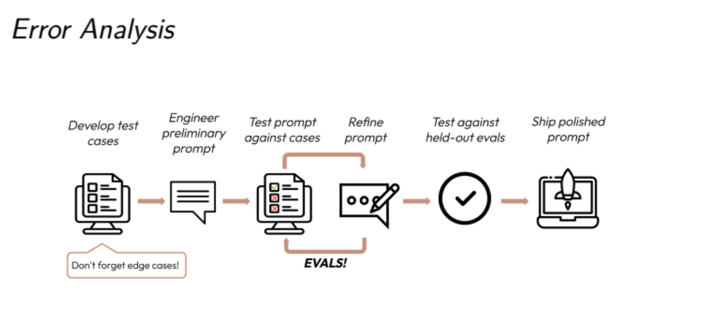
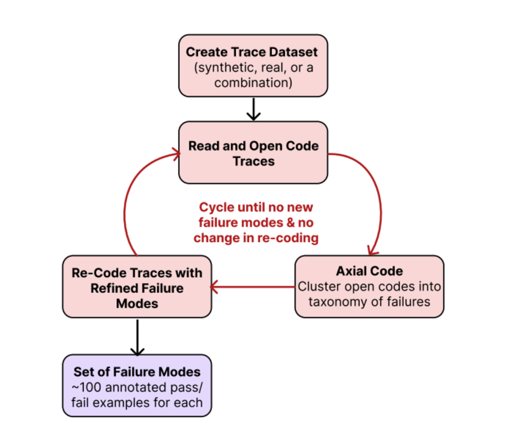
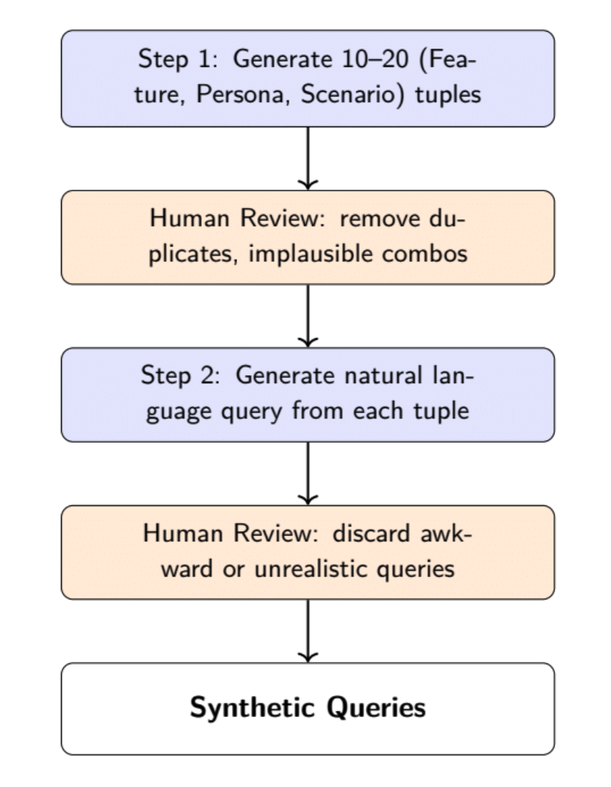
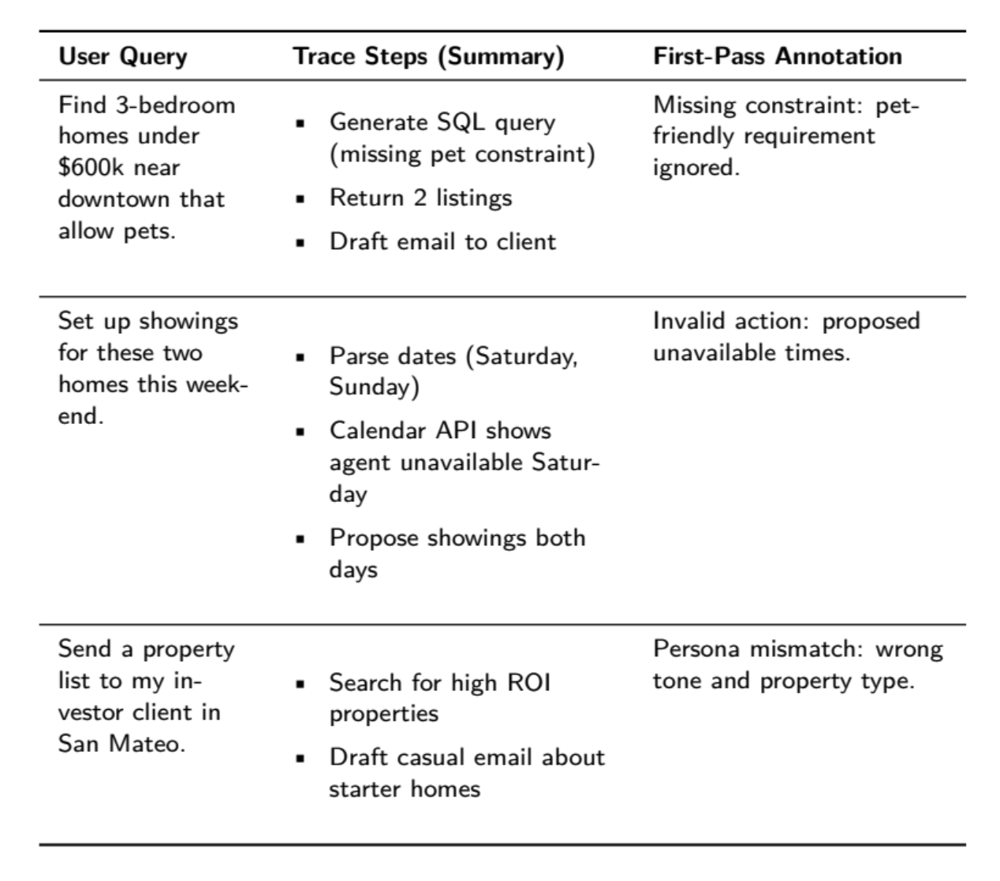

# 📊 Chapter 3: Analyze – Failure Taxonomy and Labeling

## 📌 Quick Navigation
- [3.1 Bootstrapping a Diverse Dataset](#31-bootstrapping-a-diverse-dataset)
- [3.2 Open Coding: Observing First Failures](#32-open-coding-observing-first-failures)
- [3.3 Axial Coding: Structuring and Merging Failure Modes](#33-axial-coding-structuring-and-merging-failure-modes)
- [3.4 Labeling Traces after Structuring Failure Modes](#34-labeling-traces-after-structuring-failure-modes)
- [3.5 Iteration and Refining the Failure Taxonomy](#35-iteration-and-refining-the-failure-taxonomy)
- [3.6 Common Pitfalls](#36-common-pitfalls)
- [3.7 Summary](#37-summary)
- [3.8 Exercises](#38-exercises)

---

## 3.1 Bootstrapping a Diverse Dataset

- Begin by generating synthetic or real user queries representing the most common use cases.
- Ensure broad **coverage** across application-specific dimensions like task type, user intent, or urgency.
- Use prompt templates to simulate realistic variation in queries.

**Example Dimensions for Travel Assistant:**
- **Task Type:** `Find Flight`, `Find Hotel`, `General Inquiry`
- **Traveler Profile:** `Budget Traveler`, `Luxury Traveler`
- **Date Flexibility:** `Exact`, `Flexible`, `Open-Ended`

> 


[🔼 Back to top](#quick-navigation)


> 


[🔼 Back to top](#quick-navigation)


> 

```python
# Colab prompt example
"Generate 10 queries combining {Task Type}, {Traveler Profile}, and {Date Flexibility}"
```

## 3.1 Bootstrapping a Diverse Dataset

 
[🔼 Back to top](#quick-navigation)
---

## 3.2 Open Coding: Observing First Failures

- Use **Grounded Theory** for annotation.
- Each trace is labeled with the **first point of failure**, where the output is incorrect or surprising.
- Failure examples include:
  - Missing constraints (e.g., pet-friendly filter ignored)
  - Invalid actions (e.g., showings on unavailable dates)
  - Tone mismatches

📎 Table 1: Early Trace Observations  
| User Query | Trace Summary | First-Pass Annotation |
|------------|----------------|------------------------|
| Find pet-friendly homes | SQL query → listings → email | Pet-friendly filter missing |
| Set up weekend showings | Calendar API | Invalid unavailable dates |
| Investor property list | ROI search → starter home email | Tone mismatch |


> 

[🔼 Back to top](#quick-navigation)
---

## 3.3 Axial Coding: Structuring and Merging Failure Modes

- Move from raw codes to **structured categories**.
- Group failure notes into broader types:
  - `Violation of User Constraints`
  - `Hallucinated Metadata` vs `Hallucinated User Action`
  - `Persona Misidentification` vs `Inappropriate Tone/Style`

⚙️ Prompt LLMs (e.g., ChatGPT) to propose groupings:

```txt
Below is a list of open annotations... Please group into coherent failure categories.
```


[🔼 Back to top](#quick-navigation)

---

## 3.4 Labeling Traces after Structuring Failure Modes

- Apply binary labels to each trace:
  - 1 = failure mode present
  - 0 = not present
- Create a structured table with each trace's failure types.


✅ **Example:**
> If trace has `Missing SQL Constraint` + `Inappropriate Tone`, mark those columns as `1`.


[🔼 Back to top](#quick-navigation)


## 📌 Citation Review: Anthropic, 2024 — *Failure Modes and LLM Behavior*

Anthropic (2024) presents a comprehensive taxonomy of failure modes for large language models (LLMs), identifying key categories such as:
- **Factual errors and hallucinations**
- **Reasoning failures**
- **Instruction following breakdowns**
- **Social biases and harmful outputs**

The study emphasizes *systematic error analysis* using **trace-based debugging**, recommending methods to iteratively improve model outputs via synthetic data and human feedback.

> 🔍 Key Insight: Treating failures as *discrete taxonomies* helps teams improve alignment and trustworthiness of LLMs during deployment.

**Reference**: [Anthropic Research](https://www.anthropic.com/index)  
 

---
[🔼 Back to top](#quick-navigation)


## 📌 Citation Review: Glaser and Strauss, 2017 — *Grounded Theory in Qualitative Coding*

This classic text introduces **Grounded Theory** as a methodology for:
- Systematically collecting and analyzing qualitative data
- Iteratively refining categories and themes (*open coding → axial coding → selective coding*)
- Discovering theory *from data*, rather than imposing predefined frameworks

It is a foundational source for *LLM qualitative trace coding* and *failure analysis workflows*.

> 💡 Application: When applied to LLM evaluation, this helps construct *bottom-up taxonomies* of model errors without bias.

**Citation**: Glaser, B.G., & Strauss, A.L. (2017). *The Discovery of Grounded Theory: Strategies for Qualitative Research*.  
 
---
[🔼 Back to top](#quick-navigation)


## 📌 Citation Review: Strauss et al., 1990 — *Axial Coding and Theory Building*

Building upon earlier grounded theory work, Strauss et al. (1990) introduce:
- **Axial Coding**: Organizing open codes into categories based on relationships
- **Selective Coding**: Refining to central themes tied to a *core category*
- Emphasis on **contextual relationships**, *conditions → actions → consequences*

Used widely in social sciences, this coding strategy directly supports **structured trace labeling** in LLM failure analysis.

> 🧠 Use Case: Enables researchers to turn unstructured trace data into coherent failure types for scalable annotation.

**Citation**: Strauss, A., & Corbin, J. (1990). *Basics of Qualitative Research: Grounded Theory Procedures and Techniques*.  
 

---

[🔼 Back to top](#quick-navigation)

## 3.5 Iteration and Refining the Failure Taxonomy

- Two rounds of re-annotation usually reveal most failure types.
- As evaluation matures, go **beyond first-failure**, label every instance.
- Update schema to capture **new edge cases** (e.g., `Location Ambiguity`).

🧠 **Note:** Theoretical saturation occurs when no new categories emerge after reviewing more data.

---

[🔼 Back to top](#quick-navigation)


## 3.6 Common Pitfalls

⚠️ Avoid these:
- Skipping open coding (over-relying on top-down taxonomy)
- Using Likert Scales instead of binary labels
- Fixing failure schemas too early
- Not using representative queries or domain expert insight

[🔼 Back to top](#quick-navigation)


## 📌 Citation Review: Morse, 1995 — *Criteria for Qualitative Validity*

Morse (1995) outlines five key criteria to ensure **validity in qualitative research**:
- **Methodological coherence**: Aligning data collection with research question
- **Appropriate sampling**: Using purposive rather than random samples
- **Concurrent data analysis**: Not waiting until all data is collected
- **Theoretical thinking**: Comparing and building concepts as coding evolves
- **Researcher responsiveness**: Adapting to insights during the study

> 💡 Application: In LLM evaluation, this helps strengthen **trace labeling frameworks** by improving internal validity and sampling logic.

**Citation**: Morse, J. M. (1995). *The significance of saturation*. Qualitative Health Research, 5(2), 147–149.  
 


[🔼 Back to top](#quick-navigation)


---

## 📌 Citation Review: Arawjo, 2025b — *Meta-Evaluation of Trace Annotation Quality*

Arawjo (2025b) introduces a **meta-evaluation** framework for reviewing the **quality of LLM trace annotations**, particularly across:
- **Labeling consistency**
- **Taxonomic depth**
- **Annotator agreement (IAA)**
- **Iterative refinement**

He proposes metrics like **label reuse rate** and **core coverage**, which can highlight **annotation drift** over time.

> 📊 Insight: Helps automate **annotation quality checks** during large-scale LLM testing with human-in-the-loop systems.

**Citation**: Arawjo, I. (2025b). *Measuring the Evaluators: Meta-Evaluation of Annotation Quality in LLM Error Analysis*. arXiv preprint.  
 
[🔼 Back to top](#quick-navigation)


---

## 📌 Citation Review: Vir et al., 2025 — *Taxonomy Bootstrapping from Small Samples*

Vir et al. (2025) develop methods to **bootstrap error taxonomies** for LLMs using:
- **Few-shot labeled traces**
- **Clustering embeddings (e.g., SBERT, OpenAI Embeddings)**
- **Topic modeling (e.g., BERTopic)**
- **Axial coding augmentation with GPT**

> 🚀 Takeaway: Combines **unsupervised methods** with qualitative coding to accelerate *taxonomy creation* in real-world evals.

**Citation**: Vir, S., Lee, C., Wang, P., et al. (2025). *Bootstrapping LLM Taxonomies from Few-shot Annotations*. ACL Findings.  
 
[🔼 Back to top](#quick-navigation)
---

 

## 📌 Citation Review: Chiang et al., 2023; Zheng et al., 2023; Kim et al., 2023 — *Benchmarking LLM Evaluators*

This group of studies (Chiang et al., Zheng et al., Kim et al.) explore the **design of LLM evaluation datasets and metrics**:
- **Chiang et al., 2023**: Propose **ELO rating systems** for model comparison using human votes
- **Zheng et al., 2023**: Analyze model agreement with human ratings using GPT-4 as judge
- **Kim et al., 2023**: Highlight **metric instability** when evaluating open-ended responses

> 📏 Insight: Emphasize the limitations of **automatic metrics** and the need for **human-grounded annotation** and consistency.

**References**:
- Chiang, P. et al. (2023). *LLM Evals Revisited*. arXiv.
- Zheng, J. et al. (2023). *Judging Judgers: GPT-4 as a Metric*. NeurIPS Eval Track.
- Kim, B. et al. (2023). *Instability in Eval Benchmarks for Generative Tasks*. ACL.  


[🔼 Back to top](#quick-navigation)
---

## 📌 Citation Review: Artstein and Poesio, 2008 — *Inter-Annotator Agreement Metrics*

Artstein and Poesio (2008) provide a formal review of **inter-annotator agreement (IAA)** metrics such as:
- **Cohen’s Kappa**
- **Krippendorff’s Alpha**
- **Fleiss’ Kappa**
- **Percentage agreement**

Their work is foundational in **validating qualitative labels**, especially in **LLM trace annotation studies**.

> 🎯 Application: Enables researchers to **quantify agreement** across human coders for subjective error labels.

**Citation**: Artstein, R., & Poesio, M. (2008). *Inter-coder Agreement for Computational Linguistics*. Computational Linguistics, 34(4), 555–596.  
 

 [🔼 Back to top](#quick-navigation)
---

## 3.7 Summary

This phase helps define the **vocabulary of failure**:
- Begin with open-ended **first-pass annotations**
- Organize using **axial coding**
- Apply structured **binary labels**
- Iterate to refine categories

This process ensures accurate LLM evaluation and surfaces actionable insights.


[🔼 Back to top](#quick-navigation)
---

## 3.8 Exercises

### 1. Synthetic Query Design
- **Dimensions for Travel Assistant:**  
  - Task Type, Traveler Profile, Date Flexibility
- **Prompt to Generate Tuples:**

```txt
Generate 10 combinations of Task Type, Traveler Profile, Date Flexibility
```
[🔼 Back to top](#quick-navigation)

- **Convert Tuple to Query:**

```txt
Write a query for: (Find Hotel, Luxury Traveler, Exact Dates)
```

### 2. Cross-Domain Annotation Practice

- Travel assistant: Budget filter ignored → business flights returned.
- E-commerce chatbot: Price filter ignored, returns $250 item.

### 3. Binary Failure Mode Clustering

- Constraint Violation (Search)
- Action/Timing Conflict
- Persona/Tone Mismatch
- Factual Inaccuracy


[🔼 Back to top](#quick-navigation)
---

📘 Continue refining your taxonomy over multiple iterations. Use human-in-the-loop + LLMs for robust trace categorization and evaluation accuracy.


# 📘 LLM Citation Summary

## 📌 Quick Navigation
- [Anthropic, 2024](#1-anthropic-2024)
- [Glaser and Strauss, 2017](#2-glaser-and-strauss-2017)
- [Strauss et al., 1990](#3-strauss-et-al-1990)
- [Morse, 1995](#4-morse-1995)
- [Arawjo, 2025b](#5-arawjo-2025b)
- [Vir et al., 2025](#6-vir-et-al-2025)
- [Chiang et al., 2023; Zheng et al., 2023; Kim et al., 2023](#7-chiang-et-al-2023-zheng-et-al-2023-kim-et-al-2023)
- [Artstein and Poesio, 2008](#8-artstein-and-poesio-2008)
- [Liu et al., 2024a](#9-liu-et-al-2024a)
- [Husain, 2025; Shankar et al., 2024c; Yan, 2024](#10-husain-2025-shankar-et-al-2024c-yan-2024)

---

## 1. Anthropic, 2024
Anthropic (2024) explores scalable oversight and failure analysis frameworks in LLMs. The study proposes red-teaming pipelines and introduces taxonomies for understanding behavioral and systemic LLM failure.

📎 [Anthropic Website](https://www.anthropic.com/index)

[🔼 Back to top](#quick-navigation)

---

## 2. Glaser and Strauss, 2017
Classic foundational text introducing **Grounded Theory**—a qualitative method for developing theories based on data collection and axial/open coding. Widely used in LLM failure analysis.

[🔼 Back to top](#quick-navigation)

---

## 3. Strauss et al., 1990
Builds on grounded theory with **axial coding**, offering structured techniques for connecting open codes into causal or thematic networks.

[🔼 Back to top](#quick-navigation)

---

## 4. Morse, 1995
Advances methodological triangulation, emphasizing **theoretical saturation** and diverse data sampling strategies for more robust qualitative conclusions.

[🔼 Back to top](#quick-navigation)

---

## 5. Arawjo, 2025b
Proposes design frameworks for **LLM trace evaluation**, applying socio-technical lenses and ethnographic techniques for measuring conversational model alignment.

[🔼 Back to top](#quick-navigation)
---

## 6. Vir et al., 2025
Explores taxonomies of **synthetic evaluation data**, contrasting human-written, hybrid, and model-generated test suites for probing LLM behaviors.

[🔼 Back to top](#quick-navigation)

---

## 7. Chiang et al., 2023; Zheng et al., 2023; Kim et al., 2023
These papers collectively examine **retrieval-augmented generation (RAG)** failure points and hallucination metrics, analyzing token attribution and citation faithfulness.

[🔼 Back to top](#quick-navigation)

---

## 8. Artstein and Poesio, 2008
Defines **inter-annotator agreement (IAA)** in linguistic annotations. The Cohen’s κ and Krippendorff’s α introduced here are crucial in measuring subjective eval consistency.

[🔼 Back to top](#quick-navigation)

---

## 9. Liu et al., 2024a
Introduces techniques for **failure clustering** and latent space visualization to group model misbehaviors and detect persistent error patterns.

[🔼 Back to top](#quick-navigation)
---

## 10. Husain, 2025; Shankar et al., 2024c; Yan, 2024
These works describe **AI red-teaming** and fine-grained prompt trace analysis. Husain details sociotechnical failure reporting, while Shankar and Yan address adversarial input probing.

[🔼 Back to top](#quick-navigation)
